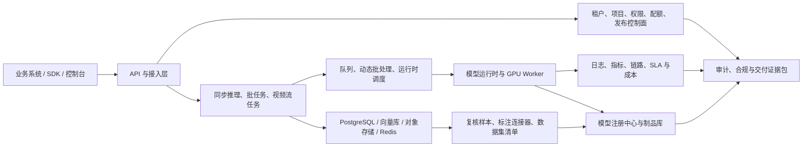

# 影鉴商业产品级升级开发功能文档

> 文档版本：0.2
> 编制日期：2026-07-23
> 文档状态：Draft - 待产品、安全、运维与交付负责人批准
> 适用版本：portrait-hub 0.17.0+

## 文档控制

| 项目       | 内容                                                                    |
| ---------- | ----------------------------------------------------------------------- |
| 文档所有者 | 产品负责人                                                              |
| 技术所有者 | 平台/后端负责人、算法负责人                                             |
| 必须评审   | 产品、算法、后端、前端、测试、SRE、安全、隐私/法务、交付                |
| 最终批准   | 产品负责人、安全负责人、运维负责人、交付负责人                          |
| 评审状态   | 未批准；P0 范围、量化门槛、资源计划和适用法规确认后方可转为 Approved    |
| 变更规则   | 需求、范围、SLA、数据处理目的和上线门禁的变更必须记录决策、影响和批准人 |

### 修订记录

| 版本 | 日期       | 变更摘要                                                             | 状态  |
| ---- | ---------- | -------------------------------------------------------------------- | ----- |
| 0.1  | 2026-07-23 | 初版商业产品级升级路线                                               | Draft |
| 0.2  | 2026-07-23 | 补充产品定义、现状复用、商业生命周期、量化验收、合规、追踪和资源治理 | Draft |

## 1. 文档目的

本文档基于当前代码、部署配置、验收文档、模型治理规范和生产就绪检查结果，给出“影鉴”从平台级工程基础升级为可交付、可运营、可持续演进的商业产品的开发方案。

本文档用于统一产品、算法、后端、前端、测试、运维、安全和交付团队的实施边界，作为后续需求拆分、技术设计、迭代排期、验收和上线决策的依据。

## 2. 项目定位与当前基线

### 2.1 项目定位

影鉴定位为面向多业务项目的结构化人像解析服务平台，核心能力包括：

- 人像、人体、姿态、步态、外观属性等视觉能力的统一推理服务。
- 人员库、向量检索、比对、轨迹和视频流任务等业务能力。
- 面向租户与项目的 API、控制台、权限、配额、审计和运维能力。
- 面向私有化、GPU、多进程和容器环境的生产部署能力。

商业化方向应优先服务“企业私有化交付 + 平台 API 服务”两类场景，并保留演进为多租户 SaaS 的能力。

### 2.2 已具备的商业化基础

当前项目已经具备较强的平台级基础：

- `/v1` 版本化 API、统一响应信封、`schema_version`、`request_id` 和稳定错误码。
- 租户、项目隔离，以及 API Key、JWT、OIDC、会话和 WebSocket 授权链路。
- RBAC、CSRF、请求限流、请求体限制、安全响应头、SSRF 防护和审计链。
- PostgreSQL、pgvector/Qdrant、S3/MinIO、Redis Streams 等生产后端适配。
- Prometheus 指标、结构化日志、链路标识和可选 OpenTelemetry 接入。
- 模型卡、治理 sidecar、模型摘要校验和模型生产就绪检查机制。
- SBOM、依赖审计、镜像扫描、签名和供应链安全检查基础。
- 管理控制台、分析工具、模型发布、评估、日志、备份和运维入口。

这些能力说明项目已具备商业产品的工程骨架，但尚未完成完整的生产能力闭环。

### 2.3 核心差距

| 领域         | 当前情况                                                                            | 商业产品要求                                         | 优先级 |
| ------------ | ----------------------------------------------------------------------------------- | ---------------------------------------------------- | ------ |
| 模型能力     | `appearance`、`face_detection`、`face_embedding`、`gait`、`pose` 未通过完整严格检查 | 真实模型、版本、摘要、评估、阈值和回归证据齐备       | P0     |
| 生产依赖     | 平台级严格检查通过，但真实外部依赖栈的端到端演练不完整                              | 在类生产环境完成故障、恢复、回滚和告警验证           | P0     |
| 性能容量     | 缺少统一、可复现的容量基线                                                          | 明确单机/集群容量、p95/p99、显存、队列和检索精度边界 | P0     |
| 推理调度     | 已有运行时抽象，缺少成熟的跨请求动态批处理和弹性调度                                | 稳定承载突发流量并控制成本                           | P1     |
| 模型生命周期 | 有配置、治理和发布基础，注册、评估、灰度、回滚闭环仍需增强                          | 模型全生命周期可追踪、可审批、可回滚                 | P1     |
| 数据闭环     | 有评估和人工复核基础，标注和主动学习链路未产品化                                    | 低置信样本自动回流，形成数据集和再训练闭环           | P1     |
| 商业运营     | 配额、调用日志已有基础，缺少客户自服务、成本和 SLA 产品界面                         | 可计量、可解释、可运营、可交付                       | P2     |
| 合规交付     | 有隐私和供应链制度，缺少一键式交付证据包                                            | 可向客户和审计方输出完整证据                         | P2     |

### 2.4 现有能力复用与改造矩阵

开发前必须以实际路由、数据结构、控制台页面和自动化测试为准完成能力盘点。下表用于约束方案边界，避免为已有能力建设平行 API、平行数据表或第二套控制台。

| 能力域                    | 0.17.0 基线                                             | 目标增量                                             | 实施策略                                      |
| ------------------------- | ------------------------------------------------------- | ---------------------------------------------------- | --------------------------------------------- |
| 认证、RBAC、租户/项目隔离 | 已有 API Key、JWT、OIDC、会话、项目上下文和对象级边界   | 补充商业角色、step-up authentication 和审批权限      | 复用并扩展现有权限体系                        |
| 项目与接入应用            | 已有租户、项目、应用密钥、日配额和用量摘要              | 增加交付档案、权益、预算、预测和客户生命周期         | 扩展现有 access 模块，不新建平行目录          |
| 模型配置与发布            | 已有预热、重载、加权灰度、命中预览、回滚和发布审计      | 增加注册、评估门槛、审批、别名和发布状态机           | 将现有 rollout 作为执行层，注册中心作为控制层 |
| 阈值、评估与复核          | 已有阈值配置、只读建议、轨迹复核和样本基础              | 增加统一样本池、标注连接、数据集 manifest 和主动学习 | 迁移/扩展现有实体和页面                       |
| SLO 与运维                | 已有调用日志聚合、错误预算、p95/p99、GPU 队列和告警基础 | 增加 SLA 口径版本、事故、客户报告和成本归因          | 复用现有指标，禁止重复计算口径                |
| 视频与流任务              | 已有上传、任务、流、轨迹和高级参数                      | 增加断点恢复、证据时间线、人工复核和产品化状态       | 扩展现有任务状态与对象存储协议                |
| 安全与供应链              | 已有审计链、SBOM、漏洞审计、镜像扫描和签名基础          | 增加环境级验证和一键证据包                           | 聚合现有检查结果，不复制扫描器                |
| 离线部署                  | 已有 Compose 镜像导出、模型和运行时配置流程             | 增加标准离线包、签名验证、授权和升级包               | 将现有流程产品化并纳入支持矩阵                |
| 五项真实模型              | 配置与运行时骨架已存在，真实权重未通过完整严格门禁      | 合法模型制品、评估、模型卡和回归证据                 | P0 新增资产与适配，不重写通用运行时           |
| 真实数据栈演练与容量      | 平台检查通过，真实环境证据不足                          | 故障/恢复/回滚/告警/容量报告                         | P0 新增环境和证据                             |

每个需求进入开发前必须补充：现有入口、现有 API、现有存储、拟复用代码、迁移方案、弃用对象和回滚方式。无法说明这些信息的需求不得进入实现阶段。

## 3. 对标原则

本方案吸收成熟推理服务、机器学习平台和 AI 治理产品的通用理念，但不要求简单复制外部系统。

| 对标方向              | 参考理念                                             | 在本项目中的落点                           |
| --------------------- | ---------------------------------------------------- | ------------------------------------------ |
| NVIDIA Triton         | 动态批处理、模型仓库、多框架运行时、实例组和性能分析 | 推理队列、批处理、预热、模型实例和容量基线 |
| KServe                | 声明式模型服务、弹性伸缩、灰度和可观测性             | Kubernetes 部署、HPA/KEDA、金丝雀和回滚    |
| MLflow Model Registry | 模型版本、别名、阶段、审批和血缘                     | 模型注册中心、发布事件和审批流             |
| Label Studio / CVAT   | 标注任务、数据导入导出和审核                         | 复核样本池、标注连接器和数据集清单         |
| OpenTelemetry         | traces、metrics、logs 的统一关联                     | 请求、任务、模型、队列和依赖链路关联       |
| OWASP API Security    | 对象级授权、身份认证、资源消耗和配置安全             | 项目隔离、RBAC、限流、SSRF 和生产门禁      |
| NIST AI RMF           | 风险识别、测量、治理和持续管理                       | 模型卡、偏差评估、人工复核、漂移和审计     |

## 4. 升级目标与范围

### 4.1 商业产品 1.0 目标

商业产品 1.0 应达到以下结果：

1. 五项核心视觉能力全部由可验证的真实模型提供，生产环境不存在静默回退或占位实现。
2. 真实生产依赖栈通过部署、故障、恢复、备份、回滚、告警和容量验收。
3. 模型从注册、评估、审批、灰度到回滚形成完整生命周期。
4. 客户能够自助管理项目接入、密钥、用量、配额、告警和开发资料。
5. 运维能够按租户、项目、模型和任务定位性能、成本、异常和 SLA。
6. 每次交付都能生成可验证的镜像、模型、安全、隐私和运行证据。

### 4.2 非目标

本阶段不以以下事项为强制目标：

- 建设通用机器学习训练平台，替代专业训练框架和实验管理工具。
- 同时支持所有云厂商和所有 GPU/加速芯片。
- 为所有行业开发固定业务流程。
- 在商业产品 1.0 阶段引入复杂计费结算或在线支付。
- 为了追求微服务形式而拆分稳定、内聚的现有模块。

### 4.3 目标客户与用户角色

商业产品 1.0 的主要客户是需要将结构化人像能力接入自有系统、并要求私有化部署、权限隔离和审计证据的企业或机构。产品不是面向个人消费者的通用相册，也不直接替代客户的业务决策系统。

| 角色              | 核心任务                                    | 关键权限边界                                 |
| ----------------- | ------------------------------------------- | -------------------------------------------- |
| 客户业务负责人    | 选择场景、确认价值、成本、SLA 和风险        | 查看业务与 SLA 报告，不默认访问原始生物特征  |
| 租户管理员        | 开通项目、成员、应用和配额                  | 仅管理本租户；高风险导出和删除需要审批       |
| 项目管理员/开发者 | 创建凭据、接入 API/SDK、配置 Webhook 和排障 | 仅管理授权项目，不可修改平台级模型和安全基线 |
| 业务操作员/复核员 | 处理分析任务、复核轨迹和纠正结果            | 按任务和数据范围授权，默认脱敏               |
| 算法工程师        | 注册模型、评估、阈值标定和发布申请          | 不能单人批准高风险生产发布                   |
| SRE/运维人员      | 部署、扩缩容、告警、事故、备份和恢复        | 运维权限不自动包含业务原始数据读取权         |
| 安全/隐私审计员   | 查看审计、合规、数据处理和交付证据          | 原则上只读；敏感样本访问需单独授权           |

### 4.4 交付形态与产品权益

| 交付形态         | 目标场景                        | 最低支持范围                                            | 商业产品 1.0 状态  |
| ---------------- | ------------------------------- | ------------------------------------------------------- | ------------------ |
| Private Standard | 单站点、单机或小规模 GPU 私有化 | Docker Compose、外部或内置生产后端、离线部署、备份恢复  | 必须交付           |
| Private HA       | 中大型、高可用私有化            | Kubernetes、外部 PostgreSQL/Qdrant/S3/Redis、弹性和灰度 | 完成真实演练后发布 |
| Platform API     | 平台托管的多租户 API            | 租户隔离、自服务、计量、配额、SLA 和运营能力            | 受限试点后发布     |

产品权益必须通过版本化 entitlement 表达，而不是通过客户代码分支实现。权益至少包含产品版本、允许能力、项目数、并发/流数量、模型范围、有效期和支持级别。

私有化授权要求：

- 支持离线签名授权文件及公钥验证，授权文件不得包含私钥或客户敏感数据。
- 签名无效、实例不匹配或授权被篡改时 fail-closed，并产生明确诊断和审计事件。
- 到期策略必须由合同档案配置；默认进入可告警的宽限期，限制新增项目、密钥和扩容，但不得删除客户数据或静默中断在途任务。
- 宽限期结束后的受限模式、紧急延期和恢复流程必须可审计、可演练。
- 商业产品 1.0 不实现在线支付，但必须提供可对账的权益、计量和账单导出数据。

### 4.5 产品成功指标

下列值是商业产品 1.0 的默认验收基线。合同或特定交付形态需要更高指标时，必须建立版本化覆盖项并重新完成容量与恢复验证。

| 指标               | 1.0 默认目标                                                     | 数据来源                  | 责任角色        |
| ------------------ | ---------------------------------------------------------------- | ------------------------- | --------------- |
| 完整生产就绪       | 完整 `--strict` 检查 100% 通过，严格失败数为 0                   | readiness 报告            | 技术负责人      |
| 生产模型可追溯     | 100% 生产结果可追溯到模型摘要、配置指纹、评估和发布事件          | 推理响应、注册中心、审计  | 算法负责人      |
| 标准环境部署成功率 | 支持矩阵中的干净安装、升级和回滚用例 100% 通过                   | 发布验收记录              | SRE             |
| 首次成功调用时间   | 基础设施和授权就绪后，标准接入流程在 1 个工作日内完成            | 接入验收记录              | 产品/交付       |
| 标准接入验收通过率 | 首次执行标准 smoke 套件通过率不低于 95%，失败均有稳定错误码      | 接入测试报告              | 后端/SDK 负责人 |
| 服务可用性         | 经认证 `/v1` 请求 30 天成功率不低于 99.5%                        | 调用日志聚合与 Prometheus | SRE             |
| 同步推理延迟       | 目标硬件和模型组合下，95% 推理/比对请求在 2 秒内完成，不计冷启动 | 容量基线                  | 平台负责人      |
| GPU 排队           | 10 分钟窗口排队 p95 小于 500 ms                                  | Prometheus histogram      | SRE             |
| P0/P1 发布缺陷     | P0 未关闭数为 0；P1 例外必须有批准人、控制措施和关闭日期         | 缺陷与例外清单            | 测试负责人      |
| 交付证据完整性     | 强制证据项生成率和摘要校验通过率均为 100%                        | 证据包清单                | 安全/交付       |

首次商业试点还必须建立产品运营基线：接入漏斗、首次成功调用耗时、活跃项目率、失败调用主要原因、人工复核率、误报/漏报申诉率、支持工单量和升级成功率。没有稳定基线前不承诺改进百分比。

### 4.6 客户生命周期

| 阶段       | 必须完成的产品流程                                      | 退出证据             |
| ---------- | ------------------------------------------------------- | -------------------- |
| 方案与合同 | 场景、能力、处理目的、交付形态、SLA、权益和责任边界确认 | 已批准方案与合同档案 |
| 开通       | 租户、项目、成员、授权、密钥、保留策略和通知渠道配置    | 开通清单与审计事件   |
| 接入       | SDK/API、Webhook、错误处理、幂等和沙箱 smoke            | 接入验收报告         |
| 上线       | 模型、容量、安全、隐私、回滚和告警门禁                  | 上线批准与证据包     |
| 运营       | 用量、配额、SLA、事故、成本、复核和数据权利请求         | 周期报告与工单记录   |
| 变更/续期  | 版本升级、权益变化、容量变化、模型变更和维护窗口        | 差异、审批与回滚目标 |
| 退租       | 凭据撤销、数据导出、删除、备份过期和删除证明            | 客户确认与销毁证据   |

### 4.7 关键假设与待决策项

| 编号    | 假设/决策                  | 默认处理                                                   | 最晚确认点     |
| ------- | -------------------------- | ---------------------------------------------------------- | -------------- |
| DEC-001 | 首发主要适用市场           | 以中国境内企业私有化为基线，境外部署另做法规评估           | P0 开发开始前  |
| DEC-002 | 五项真实模型的权属与许可证 | 仅接收来源、许可证和摘要可验证的制品                       | 模型接入前     |
| DEC-003 | 系统是否参与高影响自动决策 | 默认只提供辅助分析并保留人工复核，不作为唯一决策依据       | 方案签署前     |
| DEC-004 | HA 产品的合同 SLA          | 完成真实 HA 演练和容量验证后确定，不直接沿用 Standard 指标 | HA 试点前      |
| DEC-005 | 授权到期后的受限模式       | 默认宽限且不删除数据；最终行为由产品、安全、交付批准       | 授权功能设计前 |

## 5. 总体架构演进



架构演进遵循以下原则：

- 控制面和执行面职责清晰，但在规模不足时允许继续单体部署。
- 同步 API、异步任务和流式任务共享统一的授权、审计、错误码和模型版本语义。
- 模型、配置、数据和镜像均使用不可变版本或内容摘要标识。
- 可观测性覆盖从业务请求到模型执行、存储依赖和异步队列的完整链路。
- 所有高风险操作均支持预检、审批、灰度、回滚和审计。

## 6. 功能模块规划

### 6.1 P0-01 真实模型能力补齐

#### 目标

消除完整生产就绪检查中的五项模型能力阻断，使所有对外宣称的能力都由可验证、可评估、可追踪的真实模型提供。

#### 功能范围

| 能力             | 推荐技术路线                           | 必须提交的质量证据                      |
| ---------------- | -------------------------------------- | --------------------------------------- |
| `face_detection` | SCRFD、RetinaFace 或经过验证的等效模型 | 检出率、误检率、小脸和遮挡样本结果      |
| `face_embedding` | ArcFace 或经过验证的等效模型           | TAR/FAR、跨年龄/姿态/光照评估、阈值标定 |
| `pose`           | RTMPose 或经过验证的等效模型           | OKS/AP、遮挡和多人场景评估              |
| `gait`           | OpenGait 系列或经过验证的等效模型      | Rank-1、mAP、跨视角和服饰变化评估       |
| `appearance`     | 属性识别/ReID 多任务模型或等效模型     | 属性 F1、mAP、类别不平衡和置信校准      |

每个模型包必须包含：

- ONNX 或目标运行时可加载的模型制品。
- SHA-256 摘要、制品大小、来源和许可证信息。
- 模型卡与治理 sidecar。
- 输入预处理、输出后处理和张量契约。
- 默认阈值、阈值标定方法和适用范围。
- 回归样本清单及预期输出。
- 精度、延迟、吞吐、显存占用和已知限制。
- 是否允许 CPU 执行、是否支持批处理、最大批量和输入尺寸约束。

#### 配置与运行要求

- 在 `model-capabilities.yml` 中声明真实模型路径、摘要、运行时和能力状态。
- 生产环境默认 fail-closed，缺少模型、摘要、模型卡或治理文件时禁止启动对应能力。
- 禁止在生产环境将模拟输出、随机输出或静态占位输出标记为可用。
- 启动阶段执行模型装载、预热和最小推理验证。
- 运行响应和审计事件必须能追踪到模型名称、版本、摘要和配置指纹。
- `CPU_FALLBACK_ENABLED=false` 时，生产就绪检查必须验证所有必需 GPU 能力。

#### 主要改动位置

- `model-capabilities.yml`
- `examples/production-model-capabilities.example.yml`
- `models/*.governance.yml`
- `app/runtime_face.py`
- `app/runtime_pose.py`
- `app/runtime_gait.py`
- `app/runtime_appearance.py`
- `app/portrait_model_runtime.py`
- `tools/portrait_production_readiness.py`
- 对应单元、契约、集成和回归测试

#### 验收标准

- `python tools/portrait_production_readiness.py --strict` 返回成功。
- 五项能力分别完成装载、预热和固定样本推理。
- 篡改模型制品后，摘要检查能够阻止发布或启动。
- 缺少模型卡、治理 sidecar 或必填字段时，发布门禁失败。
- 同一模型和相同输入在允许误差内可复现。
- 模型变更不会破坏现有 `/v1` 响应契约。

### 6.2 P0-02 真实依赖栈与生产演练

#### 目标

在类生产环境验证 PostgreSQL、向量库、对象存储、Redis Streams 和可观测性链路，确认系统不仅能部署，而且能在故障后恢复。

#### 环境要求

- PostgreSQL 作为业务数据与审计数据主存储。
- pgvector 或 Qdrant 作为生产向量检索后端。
- S3 或 MinIO 作为图片、视频、导出文件和证据包存储。
- Redis Streams 作为异步任务和事件流后端。
- OpenTelemetry Collector、Prometheus 和 Grafana 组成观测链路。
- 使用与生产一致的反向代理、TLS、密钥注入和镜像构建流程。

#### 必做演练

1. PostgreSQL 全量备份、增量策略验证和指定恢复点恢复。
2. 向量索引重建、切换和一致性抽检。
3. 对象存储短时不可用、超时和恢复后的任务重试。
4. Redis consumer 停止、消息积压、pending reclaim 和重复消费。
5. 数据库连接池耗尽、慢查询和连接恢复。
6. GPU OOM、模型装载失败、Worker 退出和服务降级。
7. 新版本发布失败后的应用与模型回滚。
8. 告警触发、通知、确认、恢复和事件审计。

#### 验收标准

- 每项演练都有前置条件、执行步骤、预期结果、实际结果和责任人。
- 恢复后的数据完整性、队列一致性和模型版本一致性可验证。
- 严重故障满足第 10.8 节对应交付形态的 RTO/RPO，并提交真实恢复时间线和数据对账结果。
- 告警能够包含环境、项目、组件、严重级别、时间窗口和定位入口。
- 演练结果沉淀到 `docs/operations/`，并进入发布门禁证据。

### 6.3 P0-03 性能与容量基线

#### 目标

建立可复现的性能基线，为硬件选型、扩容、SLA、配额和成本核算提供依据。

#### 测试场景

- 单图同步解析。
- 图片批量解析。
- 人脸/人体向量提取、1:1 比对和 1:N 检索。
- 人员库录入、批量重建索引和并发查询。
- 视频文件解析、分片上传和异步任务处理。
- 实时流接入、抽帧、跟踪和事件输出。
- 多租户、多项目混合负载和突发流量。

#### 指标要求

- 请求 p50、p95、p99 延迟和成功率。
- 模型排队时间、执行时间、预处理和后处理时间。
- GPU 利用率、显存占用、显存碎片和 OOM 次数。
- CPU、内存、网络、磁盘和对象存储吞吐。
- Worker 并发数、批量大小、队列深度和积压时长。
- 向量检索 p95/p99、召回率、索引大小和更新时延。
- 按接口、模型、租户和项目划分的吞吐与失败率。

#### 交付物

- `docs/operations/CAPACITY_BASELINE.md`
- 可重复运行的压测脚本和固定测试数据清单。
- 单机、双机和目标集群规格下的容量表。
- 扩容阈值、限流阈值、超时、重试和熔断建议。
- 目标 SLA 下的推荐硬件规格和安全余量。

#### 验收标准

- 在固定硬件、固定模型、固定数据和固定配置下可复现。
- 基线报告记录镜像摘要、模型摘要、配置指纹和数据集版本。
- p95/p99、错误率、额定负载、资源上限和恢复行为满足第 10.8 节，并在容量报告中记录原始统计口径。
- 超过容量边界时系统表现为可观测的限流或排队，而不是静默失效。

### 6.4 P1-01 动态批处理与推理调度

#### 目标

提升 GPU 吞吐和资源利用率，同时限制排队延迟并保证租户公平性。

#### 功能要求

- 按模型、输入尺寸、契约版本和运行设备对请求分组。
- 支持 `max_batch_size`、`max_wait_ms`、`max_queue_size` 和超时预算。
- 同步请求与异步任务使用不同优先级和等待上限。
- 支持租户/项目并发上限与加权公平调度。
- 请求取消或超时后，后续结果不得错误写回业务状态。
- 批处理失败时可定位到单个请求，并按错误类型决定是否重试。
- 暴露队列深度、等待时长、实际批量、批次利用率和丢弃数指标。

#### 技术策略

第一阶段优先在现有运行时抽象中实现轻量批处理；当单机多模型调度、跨节点弹性或多框架需求明显增加时，再评估将模型执行下沉到 Triton、KServe、Ray Serve 或 BentoML 等成熟服务层。

#### 验收标准

- 相同硬件下吞吐相对关闭批处理的基线提升至少 20%，且 p95 增幅不超过 10%；不达标时默认关闭该模型的批处理。
- 不同租户之间不存在可持续的队列饥饿。
- 排队、取消、超时、部分失败和 Worker 重启均有自动化测试。
- 关闭批处理后行为与现有运行模式兼容。

### 6.5 P1-02 Kubernetes 弹性部署与模型灰度

#### 目标

为中大型私有化部署和持续交付提供可伸缩、可灰度、可回滚的标准部署方案。

#### 工作负载划分

- API/控制面服务。
- 图片与批任务 Worker。
- 视频/流式任务 Worker。
- GPU 模型 Worker。
- 调度、队列、迁移和维护 Job。

#### 功能要求

- GPU 节点亲和性、污点容忍、资源 request/limit 和设备配额。
- startup、readiness 和 liveness 探针分工明确。
- API 使用 HPA，异步 Worker 使用 KEDA 或基于队列指标的伸缩。
- 支持滚动、金丝雀、蓝绿和显式回滚。
- 按租户、项目、模型版本或请求比例进行灰度分流。
- 支持 shadow 推理，只记录对比结果，不影响正式响应。
- 发布过程检查数据库迁移兼容性、模型预热和容量余量。

#### 验收标准

- 扩缩容期间请求与任务不丢失，重复执行符合幂等约束。
- 灰度版本可以按错误率、延迟和业务质量指标自动或人工停止。
- 回滚后应用、配置、模型和数据库兼容性可验证。
- 节点故障、Pod 驱逐和 GPU Worker 异常有演练记录。

### 6.6 P1-03 模型热更新、预热与缓存一致性

#### 目标

缩短模型发布窗口，避免模型切换造成冷启动、版本混用或错误缓存。

#### 功能要求

- 使用模型摘要、运行时参数和预处理配置生成模型指纹。
- 新模型先下载、校验、装载、预热和试运行，再接收正式流量。
- 新旧模型在切换窗口内可并存，旧模型等待在途请求完成后卸载。
- 模型相关缓存键必须包含模型指纹和契约版本。
- 配置刷新支持 dry-run、差异展示、应用和回滚。
- 控制台展示模型装载状态、显存占用、预热结果和生效范围。

#### 验收标准

- 模型切换期间不返回混合版本结果。
- 新模型预热失败不会影响当前活动版本。
- 回滚无需重新上传已验证的旧模型制品。
- 所有切换操作具有操作人、审批人、原因和结果审计。

### 6.7 P1-04 模型注册中心与治理闭环

#### 目标

把现有模型配置、治理文件和发布能力提升为统一、可查询、可审批的模型生命周期管理模块。

#### 生命周期状态

`draft -> candidate -> shadow -> canary -> active -> deprecated`

异常或风险模型可以进入 `blocked`；最近稳定版本可以标记为 `rollback_target`。

#### 核心实体

- `portrait_model_registry`
- `portrait_model_artifacts`
- `portrait_model_evaluations`
- `portrait_model_release_events`
- `portrait_model_aliases`
- `portrait_model_approvals`

#### 功能要求

- 注册模型名称、能力、框架、版本、摘要、许可证和来源。
- 关联模型卡、治理 sidecar、评估报告、阈值和数据集血缘。
- 支持版本别名，如 `candidate`、`champion`、`rollback`。
- 根据能力设置精度、性能、公平性、安全和合规门槛。
- 高风险发布要求双人审批或可配置审批策略。
- 发布前展示配置差异、风险、依赖、容量和回滚目标。
- 发布后持续比较质量、延迟、错误率和资源成本。

#### 建议 API

- `GET /v1/admin/models/registry`
- `POST /v1/admin/models/registry`
- `GET /v1/admin/models/registry/{model_id}/versions`
- `POST /v1/admin/models/releases/dry-run`
- `POST /v1/admin/models/releases/apply`
- `POST /v1/admin/models/releases/rollback`
- `GET /v1/admin/models/releases/audit`

#### 验收标准

- 任一生产推理结果都能反查到完整模型版本和发布记录。
- 不满足治理或质量门槛的模型不能进入 `active`。
- 发布、灰度、暂停、回滚和弃用均有权限控制与审计。
- 注册中心不可用时，已运行模型可继续服务，但禁止新发布。

### 6.8 P1-05 数据反馈、标注连接与主动学习

#### 目标

把低质量结果和人工修正转化为可治理的数据资产，形成持续改进闭环。

#### 样本进入条件

- 低置信度或接近阈值。
- 多模型、不同模型版本或多路推理结果冲突。
- 规则校验失败或业务结果不一致。
- 人工修正、客户反馈或误报/漏报申诉。
- 漂移检测、长尾场景或定向抽样命中。

#### 功能要求

- 复核样本池支持优先级、标签、来源、模型版本和风险等级。
- 敏感原始数据使用受控对象引用，列表默认展示脱敏缩略图。
- 支持导出到 Label Studio/CVAT 兼容任务格式。
- 支持标注结果导入、字段映射、冲突检查和人工确认。
- 每次数据集生成不可变 manifest，记录样本摘要、标签版本和来源。
- 支持训练集、验证集、测试集隔离和数据泄漏检查。
- 提供错误分析、阈值建议、模型对比和发布候选报告。

#### 建议 API

- `GET /v1/evaluation/review-samples`
- `POST /v1/evaluation/review-samples/export`
- `POST /v1/evaluation/review-samples/import`
- `GET /v1/evaluation/datasets`
- `GET /v1/evaluation/datasets/{dataset_id}/manifest`

#### 验收标准

- 样本从推理结果到复核、标注、数据集和模型评估全程可追溯。
- 数据导出、访问、保留和删除遵循租户、项目与隐私策略。
- 导入重复数据、错误标签或不兼容版本时给出明确错误。
- 模型质量对比使用固定数据集版本和统一阈值口径。

### 6.9 P2-01 客户自服务与商业运营

#### 目标

降低接入和运维成本，让客户能够了解并管理自己的项目、调用、配额和服务状态。

#### 客户门户

- 项目创建、环境标识、成员、角色和服务账号管理。
- API Key 创建、轮换、过期、撤销和最近使用情况。
- 回调地址、签名密钥、IP 白名单和允许能力配置。
- API 调用量、成功率、延迟、错误分布和近期告警。
- 配额使用、剩余额度、峰值并发和预计耗尽时间。
- 文档、SDK、示例、错误码和在线请求调试。

#### 用量与成本归因

- 按租户、项目、模型、接口、图片、视频时长和 GPU 时间统计。
- 区分成功、业务拒绝、系统失败、重试和重复请求。
- 支持日/月汇总、趋势、预算阈值和异常用量提醒。
- 成本模型支持硬件摊销、存储、流量和第三方服务参数化配置。
- 商业产品 1.0 只形成计量与对账数据，不强制实现在线结算。

#### 权益与生命周期规则

- 租户商业状态至少包含 `trial`、`active`、`grace`、`suspended`、`offboarding` 和 `closed`，状态迁移必须具备原因、操作者、批准人和生效时间。
- entitlement 负责约束能力、项目、并发、视频流、模型和支持级别；配额负责运行期资源保护，二者不得混为同一字段。
- 计量记录使用不可变原始事件和版本化聚合口径；人工调整以冲正事件实现，不直接覆盖历史汇总。
- 续期、升降配、临时扩容和紧急授权均需要生效区间、审批和回滚目标。
- 暂停或授权到期不得删除数据；退租必须先提供受控导出，再按批准的保留计划执行跨存储删除并生成证明。
- 客户可导出按日、项目、能力、接口和资源类型划分的对账数据；金额、税务和发票仍由外部商务/财务系统负责。
- 客户支持至少提供问题提交、严重级别、环境与版本、request_id/任务 ID、状态、负责人、响应时间和脱敏附件字段。

#### 建议 API

- `GET /v1/access/usage/summary`
- `GET /v1/access/usage/timeseries`
- `GET /v1/access/quota/forecast`
- `GET /v1/access/projects/{project_id}/commercial-profile`
- `PATCH /v1/access/projects/{project_id}/commercial-profile`

#### 验收标准

- 客户只能查看和管理授权范围内的数据。
- API 与控制台用量口径一致，并能追踪到原始聚合依据。
- 计量重跑具备幂等性，跨日、时区和延迟任务处理有测试。
- 配额告警与实际限流行为一致。

### 6.10 P2-02 SLA、事故与运维驾驶舱

#### 目标

把技术指标转化为可运营的服务质量、事件和改进记录。

#### SLA 功能

- 按服务、租户和项目统计可用性、成功率、p95/p99 和错误预算。
- 区分计划维护、客户输入错误、上游依赖故障和平台故障。
- 支持日报、周报、月报和客户可见摘要。
- 阈值、统计窗口、排除规则和时区均需版本化。

#### 事故管理

- 事故编号、级别、影响范围、开始/恢复时间和当前状态。
- 时间线、关联告警、请求样本、模型版本和依赖状态。
- 根因、处置过程、恢复措施、责任人和后续行动项。
- 面向内部的技术报告与面向客户的脱敏报告分离。

#### 运维驾驶舱

- API 健康、错误率、延迟和限流。
- 模型装载、推理失败、批处理和 GPU 状态。
- Redis 队列积压、重试、死信和消费者状态。
- PostgreSQL 连接、慢查询和锁等待。
- 向量检索延迟、索引状态和召回抽检。
- 对象存储错误、容量和生命周期执行情况。
- OpenTelemetry traces 与 `request_id`、任务 ID 的跳转关联。

#### 建议 API

- `GET /v1/admin/operations/sla`
- `GET /v1/admin/operations/sla/reports`
- `GET /v1/admin/operations/incidents`
- `POST /v1/admin/operations/incidents`
- `GET /v1/admin/operations/health-timeline`

#### 验收标准

- SLA 结果可通过固定样本数据重算。
- 事故报告中的敏感字段根据查看者角色脱敏。
- 告警、事故、发布和审计事件能够在同一时间线上关联。
- 每个关键面板都有数据缺失、依赖异常和查询超时状态。

### 6.11 P2-03 SDK 与开发者体验

#### 目标

缩短客户接入时间，减少因重试、签名、分页和错误处理不一致造成的集成问题。

#### SDK 功能

- Python 为首个正式 SDK，后续按客户需求提供 Java/TypeScript。
- 强类型请求和响应模型，兼容当前 `/v1` 契约。
- 自动注入项目 ID、请求 ID、认证和 SDK 版本。
- 可配置超时、指数退避、抖动和仅对安全请求重试。
- 支持幂等键、分页迭代器、批量任务轮询和取消。
- 提供 Webhook 签名验证和时间窗校验工具。
- 将平台错误映射为稳定、可捕获的异常类型。
- 检查 API/SDK 兼容版本，并对弃用能力给出提示。

#### 开发者中心

- 按业务任务组织文档，而不仅按接口罗列。
- 提供可运行的最小示例、生产建议和常见错误排查。
- 支持测试项目和受限沙箱凭据。
- Webhook 调试页显示发送、重试、响应和签名验证结果。

#### 验收标准

- 核心接入流程均有 SDK 集成测试和可执行示例。
- SDK 不重试非幂等写操作，除非显式提供幂等键。
- 日志默认不输出密钥、令牌、原始生物特征或完整图片地址。
- SDK 版本发布包含变更日志和兼容性声明。

### 6.12 P2-04 视频与流式解析产品化

#### 目标

将已有视频和流任务能力从技术接口提升为完整、可恢复、可审查的业务流程。

#### 功能要求

- 视频上传支持分片、断点续传、摘要校验和失败重试。
- 任务支持取消、暂停、恢复、优先级和明确的终止原因。
- 流接入支持配置档、ROI、抽帧率、目标类别和隐私遮罩。
- 输出统一时间线、轨迹、事件、证据帧和模型版本。
- 支持轨迹合并、拆分、误报标记和人工复核。
- 实时状态包含接入、解码、推理、队列、输出和回调健康。
- 证据帧、临时分片和结果文件遵循独立保留策略。
- 断流重连、重复帧、时间戳漂移和回调失败有明确处理策略。

#### 验收标准

- 大文件、弱网、断点恢复和重复提交场景均有端到端测试。
- 同一任务重复回调不会造成业务侧重复入库。
- 流式任务在 Worker 重启后按策略恢复或明确失败。
- 时间线、证据帧和轨迹详情可通过任务 ID 和请求 ID 追踪。

### 6.13 P2-05 企业合规交付证据包

#### 目标

将已有安全、隐私、治理和供应链能力组织成可验证的客户交付材料。

#### 证据包内容

- 系统版本、Git 提交、构建时间和容器镜像摘要。
- SBOM、漏洞扫描结果、例外说明和镜像签名验证结果。
- 模型清单、版本、SHA-256、模型卡、治理 sidecar 和许可证。
- 配置基线、安全头、认证、RBAC、限流和密钥检查结果。
- 数据分类、用途、保留、删除、导出和加密策略。
- 审计链完整性检查和关键操作样本。
- 备份恢复、回滚、故障演练和容量报告。
- SLA 定义、监控覆盖和告警路由。

#### 隐私与治理要求

#### 合规适用矩阵

| 市场/规则                            | 默认适用判断                                                               | 必须映射的产品能力                                                                                 |
| ------------------------------------ | -------------------------------------------------------------------------- | -------------------------------------------------------------------------------------------------- |
| 中国《个人信息保护法》               | 处理可识别自然人的图像、生物识别或行踪信息时评估；生物识别属于敏感个人信息 | 特定目的、充分必要性、严格保护、适用时的单独同意、影响评估、权利请求、最短保留                     |
| 中国《人脸识别技术应用安全管理办法》 | 在中国境内应用人脸识别技术处理人脸信息时评估                               | 替代非人脸方式、告知/同意、未成年人监护人同意、设备/本地存储约束、公共场所提示、影响评估、备案监控 |
| 网络安全、数据安全与等级保护要求     | 由部署主体、数据级别、行业和系统定级决定                                   | 数据分类分级、访问控制、加密、审计、入侵防护、事件响应和本地化部署证据                             |
| GDPR、BIPA 及其他境外规则            | 默认不宣称满足；仅在目标地区经隐私/法务评估后启用                          | 数据主体权利、跨境、处理协议、同意或其他合法依据及地区专项限制                                     |

法规适用性必须由客户处理目的、部署地区、数据主体、行业和数据流共同决定。产品团队不得仅凭“私有化部署”推断平台不承担合规义务；本节也不替代正式法律意见。

#### 合规产品功能

- `COM-001 数据处理档案`：项目启用人脸、步态、轨迹等能力前，记录处理目的、必要性、数据类别、数据主体、合法依据、存储地区、接收方、保留期和责任联系人。
- `COM-002 告知与同意台账`：在以同意为依据时，保存告知版本、范围、时间、来源、证明、撤回状态和适用项目；禁止只保存无法审计的布尔值。
- `COM-003 未成年人保护`：涉及不满十四周岁未成年人且以同意为依据时，记录监护人同意和校验结果；不满足策略时 fail-closed。
- `COM-004 替代方式`：存在同等业务目标的非人脸方式时，不得把人脸识别设为唯一验证方式；方案和控制台必须记录替代流程。
- `COM-005 个人信息保护影响评估`：高风险能力启用前上传或生成影响评估，记录风险、缓解措施、批准人、版本和复评日期。
- `COM-006 数据驻留与传输`：记录媒体、特征、结果、日志和备份所在区域；不符合项目策略的跨区复制、互联网传输或外部导出必须阻断或审批。
- `COM-007 保留与删除`：对原始媒体、特征向量、结果、日志、复核样本和备份分别设置保留期；删除覆盖 PostgreSQL、向量库、对象存储、缓存、导出和过期备份，并生成摘要证明。
- `COM-008 个人权利请求`：支持访问、更正、删除、撤回和处理限制等适用请求的登记、身份核验、分派、期限、执行结果和例外依据。
- `COM-009 公共场所配置`：记录采集区域、必要性、显著提示标识、责任主体和禁用区域；隐私空间场景默认禁止配置。
- `COM-010 备案阈值监控`：按部署主体和适用口径统计人脸信息规模，在 80% 阈值预警，达到法定阈值时触发备案工作流并记录期限、材料和结果；最终统计口径由隐私/法务确认。
- `COM-011 人工复核与申诉`：系统默认提供辅助分析，不得未经批准将结果作为高影响决定的唯一依据；保留人工复核、纠正和申诉证据。
- `COM-012 隐私事件`：数据泄露、越权访问、错误导出和删除失败进入事故流程，保留影响范围、处置、通知判断和关闭批准。

生产日志、trace attributes、指标标签和告警中不得出现原始媒体、完整特征向量、访问令牌、长期签名 URL 或可直接识别个人的非必要字段。

#### 部署前验证

- 校验镜像签名、镜像摘要和 SBOM 对应关系。
- 校验模型签名或摘要、模型卡和治理文件对应关系。
- 校验生产配置基线，禁止默认密钥、弱认证和非预期回退。
- 证据包使用不可变标识，并记录生成者、时间和目标环境。

#### 验收标准

- 单次命令或控制台操作能够生成目标环境的证据包。
- 每个生产项目都有已批准且未过期的数据处理档案和适用法规清单。
- 必须告知、同意、影响评估或备案的场景缺少证据时，相关能力无法启用或进入明确的批准例外流程。
- 同意撤回、项目退租和保留到期能够触发跨数据库、向量库、对象存储、缓存与备份的验证性删除。
- 非人脸替代方式、未成年人策略、公共场所提示和数据驻留分别有正向与拒绝路径测试。
- 权利请求、导出、删除、例外和隐私事故均有权限、期限、审计和脱敏验证。
- 证据包中的每项结论均可追溯到原始检查或制品。
- 客户版证据包默认脱敏，内部版受更高权限保护。
- 证据包生成失败时不得输出误导性的“通过”状态。

### 6.14 P3-01 行业方案模板

#### 目标

在核心平台稳定后，用可配置模板缩短行业项目交付周期，而不是复制代码分支。

#### 首批建议模板

- 园区安全与重点区域巡检。
- 零售客流与服务质量分析。
- 工地人员安全与合规着装。
- 会展、活动和大型场馆人员流动分析。
- 校园、访客与受控区域管理。

#### 模板内容

- 能力组合与模型版本建议。
- 阈值、规则、ROI、抽帧和性能配置。
- 数据保留、隐私遮罩和人工复核策略。
- 控制台菜单、看板和报表模板。
- Webhook 事件、字段映射和第三方集成示例。
- 验收样本、容量假设、风险清单和交付检查表。

#### 验收标准

- 模板是版本化配置和文档，不产生不可维护的客户专属代码分叉。
- 模板应用前展示差异，应用后可回滚。
- 行业规则和模型结果明确区分，避免将业务规则固化进模型运行时。

## 7. 数据与存储设计建议

### 7.1 新增实体

建议优先使用 PostgreSQL 保存控制面和审计数据：

| 实体                            | 用途                               |
| ------------------------------- | ---------------------------------- |
| `portrait_model_registry`       | 模型逻辑标识、能力和基础元数据     |
| `portrait_model_artifacts`      | 模型制品、摘要、位置、格式和许可证 |
| `portrait_model_evaluations`    | 数据集、指标、阈值、环境和评估结果 |
| `portrait_model_release_events` | 发布、灰度、暂停、回滚和弃用事件   |
| `portrait_model_approvals`      | 发布审批、意见和策略结果           |
| `portrait_dataset_manifests`    | 不可变数据集清单与血缘             |
| `portrait_review_samples`       | 待复核样本、原因、优先级和处理状态 |
| `portrait_annotation_exports`   | 标注任务导出和外部任务映射         |
| `portrait_annotation_imports`   | 标注结果导入、校验和冲突记录       |
| `portrait_usage_daily_summary`  | 日级用量聚合                       |
| `portrait_cost_attribution`     | 模型、项目和资源成本归因           |
| `portrait_sla_reports`          | SLA 统计结果和口径版本             |
| `portrait_incidents`            | 事故、影响、时间线和行动项         |
| `portrait_delivery_evidence`    | 交付证据包索引、摘要和状态         |

### 7.2 通用约束

- 所有项目级实体必须包含 `tenant_id` 和 `project_id`，并建立组合索引。
- 所有状态变更必须包含创建人、更新人、时间和审计关联标识。
- 图片、视频、模型和大型报告只保存对象存储引用及内容摘要。
- 敏感对象引用使用短期签名 URL 或后端代理，不在日志中持久化。
- 关键聚合记录保留口径版本，防止规则变化后历史数据不可解释。
- 删除流程同时覆盖数据库、向量库、对象存储、缓存和导出副本。
- 保留策略按数据类型、租户、项目和法律/合同要求配置。

### 7.3 物理设计与迁移要求

新增实体的详细设计至少包含以下字段或等效语义：

| 类别       | 必须字段/约束                                                                    |
| ---------- | -------------------------------------------------------------------------------- |
| 主键与隔离 | 不可预测主键、`tenant_id`、`project_id`；唯一约束必须包含隔离边界                |
| 并发       | `version` 或等效 CAS 字段；状态迁移使用条件更新，禁止最后写入者静默覆盖          |
| 审计       | `created_at/by`、`updated_at/by`、`request_id`、`audit_event_id`；时间统一存 UTC |
| 生命周期   | `status`、`effective_at`、`expires_at`、`retention_policy_id`、可选 `deleted_at` |
| 敏感数据   | 分类级别、加密/密钥版本、对象摘要；不得在 JSON 扩展列中绕过脱敏和索引审查        |
| 外部制品   | 对象 key、内容类型、大小、SHA-256、存储区域和生命周期状态                        |
| 口径版本   | 聚合、SLA、成本、评估和合规结论必须记录 `definition_version`                     |

数据库设计必须同时给出：

- 主外键、唯一约束、检查约束、状态迁移图和删除行为。
- 按租户/项目、时间、状态和主要查询路径设计的复合索引及 `EXPLAIN` 证据。
- 大表增长估算、分区/归档策略、批量回填上限和在线迁移节流策略。
- 事务边界、outbox/事件一致性、幂等键保存窗口和重复事件处理方式。
- expand、回填验证、切换、contract 和回滚步骤；回滚窗口内不删除旧字段。
- PostgreSQL、向量库、对象存储、Redis 和导出之间的一致性检查与修复工具。
- 数据删除证明中允许保留的最小审计信息，避免删除请求与审计义务互相冲突。

## 8. API 设计规范

### 8.1 兼容性原则

- 延续现有 `/v1`、统一响应信封、`schema_version`、`request_id` 和稳定错误码。
- 新增字段默认保持向后兼容；破坏性变更进入新版本或显式契约版本。
- 对高风险管理接口拒绝未知顶层字段，避免拼写错误造成意外配置。
- 列表接口统一分页、排序、过滤、时间范围和游标语义。
- 长任务统一返回任务 ID、状态、进度、结果引用和可重试信息。
- 幂等写操作支持 `Idempotency-Key`，并明确保存窗口和冲突语义。

### 8.2 安全原则

- 每个对象操作均验证租户、项目和对象级授权，不能只依赖路由角色。
- 管理、模型发布、数据导出和证据包接口使用独立权限点。
- 高风险操作支持二次确认、审批或 step-up authentication。
- 下载和回调地址继续执行 SSRF、协议、域名和私网地址约束。
- 限流同时覆盖用户、凭据、项目、IP、接口和资源消耗维度。

### 8.3 建议 API 分组

- `/v1/admin/models/registry/*`：模型注册、版本、评估和制品。
- `/v1/admin/models/releases/*`：预检、审批、灰度、发布和回滚。
- `/v1/evaluation/review-samples/*`：复核样本和标注交换。
- `/v1/evaluation/datasets/*`：数据集 manifest 与质量报告。
- `/v1/access/usage/*`：客户用量、趋势和导出。
- `/v1/access/quota/*`：配额、预测和告警。
- `/v1/admin/operations/sla/*`：SLA 定义、结果和报告。
- `/v1/admin/operations/incidents/*`：事故与行动项。
- `/v1/admin/evidence/*`：证据包生成、状态、下载和验证。

上述路径是信息架构建议，不是已批准的新契约。设计前必须与现有 `/v1` 路由逐项映射；可扩展现有资源时不得创建语义重复的新端点。

### 8.4 单端点契约模板

每个新增或变更端点必须在 OpenAPI 和需求卡中明确：

| 项目     | 必填定义                                                       |
| -------- | -------------------------------------------------------------- |
| 业务语义 | 调用角色、前置状态、成功效果、是否同步/异步和所有者            |
| 授权     | 认证方式、RBAC 权限、租户/项目/对象级校验和 step-up 条件       |
| 请求     | Content-Type、字段、枚举、范围、未知字段策略、幂等键和最大体积 |
| 响应     | 统一信封、`schema_version`、资源版本、时间、分页和可选字段语义 |
| 错误     | HTTP 状态、稳定 `detail.code`、`retryable`、字段错误和业务冲突 |
| 并发     | CAS/ETag、重复提交、取消、超时、重试和最终一致性说明           |
| 资源保护 | 用户/凭据/项目/IP 限流、并发、批量、查询窗口和导出上限         |
| 审计观测 | 审计事件、`request_id`、指标、trace、安全脱敏和告警            |
| 事件回调 | 事件名、版本、顺序、去重 ID、签名、重试、死信和保留期          |
| 兼容性   | 现有调用方影响、SDK 版本、弃用窗口、迁移和回滚                 |
| 测试     | 契约、权限、边界、幂等、错误、性能和 breaking-change 测试 ID   |

OpenAPI 必须是 API 与 SDK 的单一契约来源。CI 应阻止未评审的破坏性变更，并验证 Python、Node、Go、Java 或正式支持 SDK 中的生成/手写类型与服务端一致。

## 9. 控制台信息架构

建议在现有控制台结构上按用户任务重组，不另建割裂的管理应用。

| 一级模块   | 二级功能                                              |
| ---------- | ----------------------------------------------------- |
| 总览       | 项目健康、调用趋势、任务状态、配额和告警              |
| 智能分析   | 图片分析、比对检索、视频任务、流任务、轨迹复核        |
| 人员库     | 人员、样本、图库、索引状态和批量操作                  |
| 模型与评估 | 模型注册、版本、评估、灰度、发布、复核样本和数据集    |
| 接入中心   | API Key、服务账号、Webhook、SDK、示例和在线调试       |
| 运维合规   | 健康、队列、日志、链路、SLA、事故、审计、备份和证据包 |
| 商业运营   | 用量、配额、成本、预算、方案和客户报告                |

交互要求：

- 删除、回滚、密钥轮换、数据导出和模型发布必须使用高风险确认流程。
- 列表具备分页、搜索、筛选、排序、空状态、错误状态和刷新策略。
- 失败提示显示稳定错误码和 `request_id`，便于关联后端日志。
- 敏感字段按权限脱敏，下载和查看原始数据需要显式授权。
- 模型发布页展示版本差异、评估差异、容量风险和回滚目标。
- 运维页面优先呈现可操作信息，避免只展示无法定位问题的装饰性指标。
- 所有核心流程满足键盘操作、焦点可见、语义标签和合理对比度要求。

### 9.1 核心用户旅程

| 旅程          | 主角色                | 起点与关键步骤                                             | 成功退出条件                                | 强制验证                     |
| ------------- | --------------------- | ---------------------------------------------------------- | ------------------------------------------- | ---------------------------- |
| 租户开通      | 租户管理员/交付       | 创建租户与项目、成员、权益、保留策略、通知和应用密钥       | 开通清单通过，凭据仅显示一次，审计完整      | API 契约 + Playwright E2E    |
| 首次接入      | 项目开发者            | 选择项目、获取 SDK、发起 smoke、处理错误、配置 Webhook     | 在目标时间内完成首个成功调用和签名回调      | 四类 SDK/正式支持 SDK + E2E  |
| 模型发布      | 算法工程师/审批人     | 注册、评估、dry-run、审批、shadow/canary、观察、全量或回滚 | 活动版本唯一，质量/性能门槛通过，发布可追溯 | 状态机、权限、故障和回滚测试 |
| 事故处置      | SRE/安全              | 告警、影响确认、时间线、止损、恢复、客户通知、复盘         | SLA 口径更新，行动项有责任人和期限          | 故障演练 + 报告抽检          |
| 权利请求/退租 | 隐私管理员/租户管理员 | 身份核验、导出、撤权、跨存储删除、备份过期、证明           | 无残留业务数据，保留的最小审计合法且可解释  | 跨后端删除 E2E + 证据校验    |

### 9.2 页面规格与体验验收

每个新增页面或关键流程必须在需求卡中定义路由、可见角色、入口、退出条件、默认状态、加载、空数据、部分数据、依赖异常、无权限、超时和恢复行为。

- 表单字段必须说明默认值、必填、格式、边界、关联校验、保存幂等和未保存变更处理。
- 高风险操作显示对象、影响范围、不可逆部分、回滚条件和审批状态，不使用模糊的“确定”文案。
- URL 应恢复项目、页签、筛选、分页和对象详情；凭据、令牌和敏感查询不得进入 URL。
- 产品分析事件仅记录旅程步骤、结果、耗时、错误码和匿名化上下文，不采集原始媒体、生物特征或密钥。
- 核心路由以 WCAG 2.2 AA 为目标，覆盖键盘顺序、焦点不被遮挡、目标尺寸、对比度、语义名称、错误提示、可访问认证和读屏器抽检。
- axe serious/critical 问题必须为 0；自动化无法覆盖的焦点管理、读屏语义和高风险确认需要人工验收记录。
- 桌面、平板和 390px 移动视口均不得出现不可操作控件、文本遮挡或横向页面溢出；业务密集页面允许表格区域受控横向滚动。

## 10. 非功能要求

### 10.1 安全

- 生产环境认证、RBAC、审计、限流、安全头和密钥检查默认开启。
- 密钥通过外部 Secret 管理或文件挂载注入，不进入镜像和仓库。
- 所有第三方依赖、基础镜像和模型许可证进入清单与审计。
- 镜像和模型制品在部署时验证摘要或签名。

### 10.2 可用性

- 关键服务无单点，健康检查能够区分存活、就绪和依赖异常。
- 异步任务至少一次投递时，业务处理必须幂等。
- 对外服务定义超时、重试、熔断、降级和容量保护策略。
- 数据库迁移遵循向前兼容和分阶段发布原则。

### 10.3 性能

- 所有核心接口定义 p95/p99、吞吐和资源上限。
- 同步请求限制排队时间，长耗时工作转为异步任务。
- 视频、批量和导出任务具有项目级并发和资源预算。
- 向量检索的延迟优化不能绕过召回率验收。

### 10.4 可观测性

- 日志、指标和链路使用 `request_id`、任务 ID、租户、项目和模型版本关联。
- 指标禁止使用无限增长的高基数标签。
- 敏感内容不进入日志、trace attributes 或 Prometheus labels。
- 告警必须对应明确的影响、处理手册和责任人。

### 10.5 隐私与合规

- 默认最小化采集，按用途限制能力和数据范围。
- 对原始媒体、特征向量、结果、日志和导出设置独立保留期。
- 支持项目级数据导出、删除和删除证据。
- 高风险或高影响场景保留人工复核和申诉机制。

### 10.6 支持的部署矩阵

| 配置             | 目标用途             | 支持拓扑                                         | 数据与队列                                                | GPU/运行时                                                 | 发布要求                                       |
| ---------------- | -------------------- | ------------------------------------------------ | --------------------------------------------------------- | ---------------------------------------------------------- | ---------------------------------------------- |
| Development      | 本地开发和功能测试   | 单进程或开发 Compose                             | 文件/内存后端可用                                         | CPU fallback 可用                                          | 不得作为商业生产环境                           |
| Private Standard | 中小规模单站点私有化 | Ubuntu 22.04/24.04 LTS、Docker Compose、反向代理 | 生产必须使用 PostgreSQL、pgvector/Qdrant、S3/MinIO、Redis | Python 3.12；GPU 镜像以 CUDA 12.4/cuDNN 9 兼容链为当前基线 | 干净安装、升级、回滚、离线和完整 strict 通过   |
| Private HA       | 高可用私有化         | Kubernetes，多 API/Worker，GPU 节点池            | 外部 HA PostgreSQL、Qdrant、S3、Redis 和 OTel             | GPU 节点亲和、资源配额、HPA/KEDA                           | 多节点故障、扩缩容、灰度、恢复和容量验收后发布 |
| Platform API     | 平台托管服务         | 多可用区 Kubernetes 或等效编排                   | 托管 HA 数据服务、集中观测和计量                          | 按池隔离模型 Worker                                        | 多租户隔离、SLA、成本、安全和运营门禁通过      |

CPU-only 配置默认用于开发、演示或明确约定的低性能场景。除非完成独立容量和模型质量验收，不得使用 CPU fallback 满足 GPU 商业 SLA，也不得在 GPU 故障时静默降级。

每个发布版本必须生成机器可读和人工可读的支持矩阵，明确：

- 操作系统、CPU 架构、GPU 型号范围、驱动、CUDA、容器运行时和 Compose/Kubernetes 版本。
- PostgreSQL、pgvector/Qdrant、S3/MinIO、Redis、OpenTelemetry Collector 和反向代理版本。
- 在线、离线、代理网络和隔离网络的安装方式。
- 已验证的最小/推荐硬件、最大模型数、项目数、并发、流数量和数据规模。
- 支持、受限支持、实验性和不支持能力；实验性能力不得进入合同 SLA。

### 10.7 升级、兼容与支持生命周期

- 商业版本至少支持当前版本 `N` 和上一稳定版本 `N-1` 的升级路径；跨越多个版本必须按发布说明逐级迁移或使用经验证的迁移工具。
- 数据库和对象格式遵循 expand/migrate/contract，应用回滚窗口内不得执行不可逆收缩。
- 每次升级前执行配置差异、数据库备份、模型/镜像可用性和容量预检，并生成回滚目标。
- 离线升级包必须同时包含镜像、模型、配置模板、迁移脚本、SBOM、签名、摘要、发布说明和回滚材料。
- 公共 API 弃用默认至少提前 180 天公告；安全紧急变更可以缩短，但必须提供影响、迁移和批准记录。
- 每个正式版本发布支持结束日期、已知问题和安全修复策略。LTS 周期和严重漏洞响应时间在首个商业合同签署前由产品、安全和交付批准。
- 客户定制只能通过配置、插件或受控扩展点实现；确需分支时必须登记所有者、同步策略、支持期限和回归责任。

### 10.8 量化非功能验收矩阵

| 维度       | Private Standard 默认门槛                                             | Private HA / Platform API 候选门槛          | 验证方式                            |
| ---------- | --------------------------------------------------------------------- | ------------------------------------------- | ----------------------------------- |
| 可用性     | 经认证 `/v1` 请求 30 天成功率不低于 99.5%                             | 不低于 99.9%，正式承诺前必须完成 HA 演练    | 调用日志与 Prometheus 交叉核对      |
| 同步延迟   | 目标硬件下推理/比对 p95 小于 2 秒，记录 p99                           | 按模型池分别定义，版本间 p95 退化不超过 10% | 固定数据、配置和镜像压测            |
| GPU 排队   | 10 分钟窗口 p95 小于 500 ms                                           | 同左，并按设备和租户检查公平性              | histogram 与队列明细                |
| 额定负载   | 连续 30 分钟系统错误率低于 1%，队列无持续增长                         | 额外承受 10 分钟 1.5 倍突发并恢复到稳态     | 负载测试和恢复曲线                  |
| 批处理收益 | 吞吐提升至少 20%，且 p95 增幅不超过 10%；否则默认关闭                 | 按模型池单独验收                            | A/B 基线报告                        |
| 恢复目标   | 候选 RTO 不超过 4 小时、RPO 不超过 24 小时                            | 候选 RTO 不超过 60 分钟、RPO 不超过 15 分钟 | 真实备份恢复与故障演练              |
| 数据一致性 | 已确认写入丢失数为 0；重复投递按幂等契约收敛                          | 同左，并验证多副本/跨节点故障               | 对账、WAL/队列和对象摘要            |
| 模型质量   | 主指标相对已批准基线下降不超过 1 个百分点；能力专项绝对门槛写入模型卡 | 同左，并完成 shadow/canary 业务质量验证     | 固定 held-out 数据集                |
| 安全       | 可利用 Critical/High 漏洞为 0；例外必须有补偿控制和到期日             | 同左                                        | SBOM、漏洞、配置和渗透证据          |
| 无障碍     | 核心路由达到 WCAG 2.2 AA；axe serious/critical 为 0                   | 同左                                        | Playwright/axe 与人工键盘、读屏抽检 |
| 安装升级   | 支持矩阵中的安装、N-1 升级、回滚和离线用例 100% 通过                  | 加做滚动升级、节点故障和扩缩容              | 发布验收套件                        |

上述数值是产品默认门槛，不自动构成客户合同承诺。任何覆盖值必须绑定交付形态、硬件、模型、数据规模、统计窗口、排除项、批准人和生效版本。

## 11. 测试与验收门禁

### 11.1 基础门禁

每次候选发布至少执行：

```powershell
python -m pytest
python tools/type_check.py
npm run check
npm run console:e2e
python tools/openapi_compatibility_check.py --json
python tools/deploy_check.py --json --import-app
python tools/portrait_production_readiness.py --strict --scope platform
git diff --check
```

### 11.2 商业生产门禁

生产候选版本额外执行：

```powershell
python tools/portrait_production_readiness.py --strict
python tools/governance_check.py --json
python tools/model_governance_check.py --strict-governance --strict-hash --strict-sidecars --allow-missing-artifacts --json
python tools/security_audit.py
```

以上命令必须与仓库 CI 保持一致。工具参数发生变化时，工具、CI 和本文档必须在同一变更中更新；不得使用“以当前帮助为准”替代可复现的发布命令。

除自动化命令外，还必须提交：

- 真实依赖栈 smoke 与端到端结果。
- 镜像扫描、SBOM、签名和摘要验证结果。
- 模型摘要、模型卡、治理与固定样本回归结果。
- 备份恢复、故障注入、告警和回滚演练记录。
- 当前硬件与模型组合的容量基线。
- SLA 样例报告和交付证据包。

### 11.3 单功能完成定义

每项功能只有同时满足以下条件才可标记完成：

- API 契约、错误码和兼容性测试完成。
- 租户、项目、对象级授权和 RBAC 测试完成。
- 正常、空数据、超时、重试、取消和依赖失败场景完成。
- 控制台加载、错误、空状态和权限状态完成。
- 审计、日志、指标和必要链路信息完成。
- 敏感数据脱敏、保留和删除行为完成。
- 用户文档、运维手册和配置示例完成。
- 对应 readiness/deploy check 已更新，防止能力只存在于文档中。

### 11.4 发布证据与阻断责任

| 门禁     | 责任角色        | 强制证据                                        | 阻断条件                                   |
| -------- | --------------- | ----------------------------------------------- | ------------------------------------------ |
| 产品范围 | 产品负责人      | 已批准需求、范围、客户旅程和例外                | P0 范围未确认或核心旅程不可完成            |
| 模型质量 | 算法负责人      | 模型卡、治理文件、held-out 报告、摘要           | 质量门槛失败、来源或许可证不明             |
| 工程质量 | 开发/测试负责人 | 单元、契约、集成、E2E、OpenAPI/SDK 和迁移结果   | 必需测试失败或不稳定测试未处置             |
| 性能容量 | 平台/SRE        | 固定环境容量和批处理 A/B 报告                   | 额定负载、延迟、队列或资源门槛失败         |
| 安全隐私 | 安全/隐私负责人 | SBOM、扫描、威胁模型、影响评估、WCAG 和删除验证 | Critical/High 无批准例外或必需合规证据缺失 |
| 可恢复性 | SRE             | 备份、恢复、故障和回滚演练                      | RTO/RPO 或数据一致性不达标                 |
| 交付支持 | 交付负责人      | 支持矩阵、在线/离线安装升级、SLA 样例和证据包   | 目标交付形态未通过验收                     |

任一阻断项只能由表中责任角色和最终批准人共同接受例外。例外必须包含范围、影响、补偿控制、监控、到期日和关闭责任人。

## 12. 分阶段实施路线

以下工作量是立项基线，不是未经资源确认的交付承诺。日历周期从人员、环境、合法模型制品和验收数据全部就绪后开始计算。

### 12.1 资源假设

| 角色           | 建议投入       | 主要职责                                   |
| -------------- | -------------- | ------------------------------------------ |
| 产品负责人     | 1 FTE          | 范围、角色旅程、权益、指标、验收和变更控制 |
| 算法/模型工程  | 1-2 FTE        | 五项模型、评估、阈值、模型卡和数据闭环     |
| 后端/平台工程  | 2-3 FTE        | 运行时、注册、调度、数据、API 和商业能力   |
| 前端工程       | 1 FTE          | 控制台旅程、权限状态、可视化和无障碍       |
| 测试工程       | 1 FTE          | 契约、集成、E2E、性能、迁移和证据管理      |
| SRE/运维       | 1 FTE          | 真实数据栈、Kubernetes、观测、恢复和发布   |
| 安全/隐私/法务 | 各 0.2-0.5 FTE | 威胁、供应链、影响评估、法规和例外批准     |
| 交付/客户成功  | 0.5 FTE        | 支持矩阵、安装、客户验收和运营反馈         |

若模型资产、真实 GPU/staging 环境或上述关键角色没有按时投入，相应阶段必须顺延，不得通过删除严格门禁压缩周期。

### 12.2 工作量与日历区间

| 阶段                       | 工作量区间 | 建议日历区间 | 主要前置                                  |
| -------------------------- | ---------- | ------------ | ----------------------------------------- |
| Phase 0 产品与方案冻结     | 5-8 人周   | 1-2 周       | 目标市场、客户场景、交付形态和责任人确认  |
| Phase 1 生产能力闭环       | 18-30 人周 | 4-8 周       | 合法模型制品、held-out 数据和真实 staging |
| Phase 2 推理平台化         | 20-32 人周 | 6-10 周      | Phase 1 容量基线、标准镜像和观测指标      |
| Phase 3 模型与数据生命周期 | 24-40 人周 | 6-12 周      | 复核流程、数据/模型治理和对象存储         |
| Phase 4 商业运营与交付     | 30-50 人周 | 8-14 周      | 权益决策、SLA 口径、合规评估和客户试点    |
| Pilot/GA 观察与收口        | 8-14 人周  | 2-4 周       | 全部门禁通过、试点客户和支持值班就绪      |

Phase 2、Phase 3 和 Phase 4 的独立工作流可在接口、数据和责任边界冻结后并行，但共享数据库、权限、控制台或发布链路的需求必须统一设计。每两周按实际吞吐、阻断和剩余风险重估，不使用初始区间掩盖范围变化。

### Phase 0：产品与方案冻结（1-2 周，5-8 人周）

范围：

- 批准目标客户、三种交付形态、角色、核心旅程和 1.0 范围。
- 完成现有能力盘点、需求追踪、法规适用性初筛和支持矩阵草案。
- 确认模型来源、环境、人员、预算、量化门槛和试点客户。

退出条件：

- P0/P1 需求满足 Definition of Ready，所有主责和批准人到位。
- 模型资产、测试数据、GPU/staging、外部数据栈和法规评估有明确交付日期。
- 发布、回滚、例外和变更流程已批准。

### Phase 1：生产能力闭环（4-8 周，18-30 人周）

范围：

- P0-01 五项真实模型能力补齐。
- P0-02 类生产依赖栈与关键演练。
- P0-03 首版性能和容量基线。
- 完整严格生产就绪检查转为通过。

退出条件：

- 没有占位模型或静默回退。
- 真实依赖栈完成端到端和恢复验证。
- 硬件容量、SLA 候选值和扩容边界明确。

### Phase 2：推理平台化（6-10 周，20-32 人周）

范围：

- P1-01 动态批处理与调度。
- P1-02 Kubernetes 弹性部署与灰度。
- P1-03 模型热更新、预热和缓存一致性。

退出条件：

- 高并发吞吐与资源利用率达到基线目标。
- 模型和应用均支持受控灰度与快速回滚。
- 节点、Worker、GPU 和队列故障完成演练。

### Phase 3：模型与数据生命周期（6-12 周，24-40 人周）

范围：

- P1-04 模型注册中心与治理闭环。
- P1-05 复核、标注连接器、数据集和主动学习。

退出条件：

- 生产模型可从结果反查到制品、数据、评估、审批和发布。
- 低置信和业务反馈样本可以形成可治理的数据集。
- 候选模型能够通过统一门槛进入 shadow、canary 和 active。

### Phase 4：商业运营与企业交付（8-14 周，30-50 人周）

范围：

- P2-01 客户自服务、用量和成本。
- P2-02 SLA、事故和运维驾驶舱。
- P2-03 SDK 和开发者中心。
- P2-04 视频与流式任务产品化。
- P2-05 合规交付证据包。

退出条件：

- 客户可完成主要接入和日常管理流程。
- 平台可提供一致的用量、配额、SLA 和事故报告。
- 私有化交付可生成可验证、可脱敏的完整证据包。

P3 行业模板在 Phase 4 稳定后按真实客户需求滚动实施。

## 13. 建议任务拆分与责任边界

| 工作流         | 主要责任      | 协作方           | 关键产物                          |
| -------------- | ------------- | ---------------- | --------------------------------- |
| 模型生产化     | 算法/模型工程 | 后端、测试、安全 | 模型包、评估、模型卡、治理文件    |
| 推理运行时     | 后端/平台工程 | 算法、运维       | 批处理、预热、调度、运行时指标    |
| 生产部署       | SRE/运维      | 后端、安全、测试 | 部署清单、演练记录、容量报告      |
| 模型注册与发布 | 后端/平台工程 | 算法、产品、前端 | 注册中心、审批、灰度、回滚        |
| 数据反馈闭环   | 产品/算法     | 后端、前端、隐私 | 样本池、标注连接、数据集 manifest |
| 客户与商业运营 | 产品/前后端   | 运维、财务接口人 | 门户、用量、配额、成本和报告      |
| 合规交付       | 安全/交付     | 运维、算法、后端 | 证据包、隐私记录、供应链验证      |

### 13.1 RACI 基线

`A` 为最终负责且每行只能有一个角色，`R` 为执行，`C` 为必须咨询，`I` 为必须知会。具体人员姓名在立项后写入需求和发布记录。

| 决策/工作流                 | A               | R                  | C                            | I              |
| --------------------------- | --------------- | ------------------ | ---------------------------- | -------------- |
| 产品范围、SKU、指标和优先级 | 产品负责人      | 产品经理           | 技术、算法、安全、交付       | 全项目         |
| 模型质量与发布建议          | 算法负责人      | 模型工程师         | 产品、平台、测试、隐私       | SRE、交付      |
| API、数据和运行时架构       | 平台负责人      | 后端/平台工程师    | 算法、SRE、安全、测试        | 产品、前端     |
| 控制台与用户旅程            | 产品负责人      | 前端工程师         | 后端、测试、无障碍评审       | 交付、支持     |
| 生产环境、容量和恢复        | SRE 负责人      | SRE/平台工程师     | 测试、安全、算法             | 产品、交付     |
| 安全与供应链例外            | 安全负责人      | 安全/工程负责人    | SRE、算法、产品              | 交付、管理层   |
| 隐私和法规适用性            | 隐私/法务负责人 | 产品与隐私工程     | 安全、算法、客户责任人       | 交付、SRE      |
| 测试结论与发布质量          | 测试负责人      | 测试及各开发负责人 | 产品、SRE、安全              | 全项目         |
| 商业生产上线                | 产品负责人      | 发布经理/SRE       | 算法、测试、安全、隐私、交付 | 客户与支持团队 |

每个工作流都应指定一名最终责任人。跨团队功能的验收口径必须在开发开始前确认，避免将算法精度、平台稳定性或客户流程留到上线前集中处理。

## 14. 风险与控制

| 风险                     | 影响                         | 控制措施                                                |
| ------------------------ | ---------------------------- | ------------------------------------------------------- |
| 模型许可证或来源不清     | 无法商业交付                 | 注册时强制许可证、来源和摘要；交付前法务复核            |
| 真实数据不足或偏差明显   | 线上误报、漏报或不公平       | 固定评估集、分群评估、阈值标定、人工复核和漂移监测      |
| GPU 成本和峰值不可控     | SLA 下降、成本失控           | 动态批处理、配额、容量基线、队列伸缩和成本归因          |
| 灰度时模型版本混用       | 结果不可解释                 | 模型指纹、请求级版本记录、缓存隔离和在途请求排空        |
| 多后端语义不一致         | 环境差异和数据错误           | 契约测试、真实后端 E2E、迁移/恢复演练和一致性抽检       |
| 指标标签高基数           | 观测系统过载                 | 标签白名单、项目维度聚合、明细进入日志/trace            |
| 敏感数据进入日志或导出   | 隐私与合规风险               | 默认脱敏、权限分层、导出审批、短期 URL 和审计           |
| 功能文档先于实现长期漂移 | 错误承诺和验收失真           | readiness/deploy check 与功能同步更新，文档进入发布评审 |
| 过早拆分微服务           | 交付速度下降、运维复杂度上升 | 先明确控制面/执行面边界，达到容量或组织阈值后再拆分     |

### 14.1 运营风险登记

| ID    | 风险                                     | 概率 | 影响 | Owner      | 触发信号                        | 当前状态   |
| ----- | ---------------------------------------- | ---- | ---- | ---------- | ------------------------------- | ---------- |
| R-001 | 模型来源、许可证或再分发权不满足商业交付 | 中   | 严重 | 算法负责人 | 任一制品缺少可验证来源/许可证   | Open       |
| R-002 | held-out 数据不足或质量门槛失败          | 高   | 严重 | 算法负责人 | 关键分群退化或阈值无法标定      | Open       |
| R-003 | 真实 staging、GPU 或外部数据栈未按时就绪 | 高   | 高   | SRE 负责人 | Phase 1 开始前环境 smoke 未通过 | Open       |
| R-004 | 承诺周期没有对应人员投入                 | 高   | 高   | 产品负责人 | 任一关键角色低于第 12.1 节投入  | Open       |
| R-005 | 人脸/敏感个人信息合规证据不完整          | 中   | 严重 | 隐私负责人 | COM-001~010 必需项缺失          | Open       |
| R-006 | GPU 峰值、队列或存储成本超过交付假设     | 中   | 高   | 平台负责人 | 额定负载资源超过安全水位        | Open       |
| R-007 | 新功能与现有 API/页面/数据重复           | 中   | 高   | 平台负责人 | 需求卡缺少现状映射或迁移方案    | Controlled |
| R-008 | 数据迁移或离线升级无法可靠回滚           | 中   | 高   | SRE 负责人 | N-1/回滚测试失败                | Open       |
| R-009 | 试点业务误把辅助分析当作唯一高影响决定   | 中   | 严重 | 产品负责人 | 方案缺少人工复核和申诉路径      | Open       |

风险每周复核，并在阶段门禁前重新评级。每个 Open 风险必须登记预防措施、应急措施、目标日期和剩余风险；触发信号发生后转为 Issue/Incident，不得继续只保留在风险表中。

概率与影响均使用低/中/高/严重四级口径。任何“严重”影响或“高概率 × 高影响”风险必须由最终批准人决定接受、缓解、转移或停止，不得由执行人员默认接受。

## 15. 推荐优先级总表

| 编号  | 功能                  | 优先级 | 商业价值                   | 前置依赖                 |
| ----- | --------------------- | ------ | -------------------------- | ------------------------ |
| P0-01 | 真实模型能力补齐      | P0     | 对外能力可信、解除生产阻断 | 模型制品与评估数据       |
| P0-02 | 真实依赖栈与生产演练  | P0     | 降低交付和故障风险         | 类生产基础设施           |
| P0-03 | 性能与容量基线        | P0     | 支撑 SLA、报价和硬件选型   | 真实模型与生产后端       |
| P1-01 | 动态批处理与推理调度  | P1     | 提升吞吐、降低 GPU 成本    | 容量基线                 |
| P1-02 | Kubernetes 弹性与灰度 | P1     | 支撑中大型部署和持续交付   | 观测指标、标准镜像       |
| P1-03 | 模型热更新与预热      | P1     | 降低发布中断和冷启动       | 模型指纹、运行时抽象     |
| P1-04 | 模型注册中心          | P1     | 模型可追踪、可审批、可回滚 | 模型治理规范             |
| P1-05 | 数据反馈与主动学习    | P1     | 持续提升模型质量           | 复核流程、对象存储       |
| P2-01 | 客户自服务与商业运营  | P2     | 降低服务成本、形成运营能力 | 用量和配额数据           |
| P2-02 | SLA、事故与运维驾驶舱 | P2     | 提升服务可信度和响应效率   | 完整可观测性             |
| P2-03 | SDK 与开发者体验      | P2     | 缩短客户接入周期           | 稳定 API 契约            |
| P2-04 | 视频与流式任务产品化  | P2     | 扩展高价值业务场景         | 异步任务、对象存储、队列 |
| P2-05 | 企业合规交付证据包    | P2     | 提高私有化交付效率         | 安全、治理和演练产物     |
| P3-01 | 行业方案模板          | P3     | 降低行业项目复制成本       | 核心平台稳定、客户验证   |

## 16. 上线决策原则

商业产品上线不以“功能页面可见”作为通过标准。最终上线必须同时满足：

1. 对外宣称的模型能力真实可用且通过完整严格检查。
2. 真实依赖、备份恢复、回滚和告警演练通过。
3. 性能与容量满足目标客户硬件和 SLA。
4. 安全、隐私、模型治理和供应链证据齐全。
5. 客户核心流程和运维核心流程具备端到端验收记录。
6. 所有已知例外都有责任人、影响说明、临时控制和关闭日期。

任何 P0 项未完成时，不应将版本标记为完整商业生产版。可以按受限试点发布，但必须明确客户范围、能力范围、数据范围、SLA 例外和退出方案。

## 17. 需求定义、追踪与变更治理

### 17.1 需求标识与状态

需求 ID 使用稳定前缀：`MOD` 模型、`OPS` 运维、`PERF` 性能、`SCH` 调度、`DEP` 部署、`REG` 注册发布、`DATA` 数据闭环、`CUS` 客户运营、`SLA` 服务质量、`SDK` 开发者体验、`VID` 视频流、`COM` 合规、`TPL` 行业模板。

需求状态统一为：

`draft -> reviewed -> ready -> in_progress -> verification -> accepted -> released -> measured -> closed`

存在阻断时进入 `blocked`，取消时进入 `cancelled`。状态迁移必须记录操作者、时间、原因和关联证据；`released` 不等于完成，必须经过真实观察窗口后才能进入 `measured/closed`。

### 17.2 单项需求卡模板

每个进入迭代的需求必须从本路线文档拆分为独立需求卡，至少包含：

| 字段       | 必填内容                                                     |
| ---------- | ------------------------------------------------------------ |
| 标识       | REQ-ID、标题、优先级、目标版本、所有者、批准人               |
| 产品上下文 | 目标客户、用户角色、JTBD/问题、业务价值和成功指标            |
| 范围       | 范围内、范围外、依赖、假设和已知限制                         |
| 现状映射   | 现有页面、API、数据、测试；复用、改造、替换或新建决策        |
| 行为       | 前置条件、触发条件、主流程、异常流程、取消/重试/超时和状态机 |
| 规则       | 权益、配额、幂等、并发、排序、时区、精度、冲突和边界值       |
| 接口       | 请求/响应、错误码、分页、版本、Webhook/事件和 SDK 行为       |
| 数据       | 实体、约束、索引、保留、迁移、回填、删除和回滚               |
| 安全合规   | RBAC、对象级授权、审计、脱敏、合法依据、驻留和影响评估       |
| 非功能     | SLO、容量、恢复、安全、可观测性、无障碍和兼容性              |
| 交付       | 功能开关、灰度、监控、回滚、文档、支持和客户通知             |
| 验收       | Given/When/Then、数值门槛、测试 ID、证据位置和观察窗口       |

### 17.3 基线追踪矩阵

| 需求组       | 对应模块         | 基线策略                        | 主责       | 强制证据                             | 目标阶段   |
| ------------ | ---------------- | ------------------------------- | ---------- | ------------------------------------ | ---------- |
| `MOD-P0-01`  | P0-01 真实模型   | 新增合法模型资产，复用运行时    | 算法负责人 | 模型卡、摘要、评估、固定样本、strict | Phase 1    |
| `OPS-P0-02`  | P0-02 生产演练   | 新增真实环境与演练证据          | SRE        | 故障、恢复、告警、回滚、RTO/RPO      | Phase 1    |
| `PERF-P0-03` | P0-03 容量       | 新增可复现基线                  | 平台/SRE   | 负载、资源、检索质量和容量表         | Phase 1    |
| `SCH-P1-01`  | P1-01 批处理调度 | 扩展现有运行时                  | 平台负责人 | A/B、超时、取消、公平性和降级        | Phase 2    |
| `DEP-P1-02`  | P1-02 Kubernetes | 扩展现有部署入口                | SRE        | HA、扩缩容、灰度和节点故障           | Phase 2    |
| `MOD-P1-03`  | P1-03 热更新     | 扩展模型装载和配置刷新          | 平台/算法  | 指纹、预热、无混版和回滚             | Phase 2    |
| `REG-P1-04`  | P1-04 注册中心   | 复用 rollout 执行层，新增控制层 | 后端/算法  | 状态、审批、审计和可追溯             | Phase 3    |
| `DATA-P1-05` | P1-05 数据反馈   | 扩展现有复核与阈值能力          | 产品/算法  | 样本血缘、标注交换和数据集 manifest  | Phase 3    |
| `CUS-P2-01`  | P2-01 客户运营   | 扩展 access、用量和配额         | 产品/后端  | 生命周期、权益、计量和退租删除       | Phase 4    |
| `SLA-P2-02`  | P2-02 SLA/事故   | 扩展现有 SLO 和告警             | SRE/产品   | 口径版本、事故时间线和客户报告       | Phase 4    |
| `SDK-P2-03`  | P2-03 SDK        | 扩展现有 SDK 和接入指南         | SDK 负责人 | 兼容矩阵、示例、签名和重试测试       | Phase 4    |
| `VID-P2-04`  | P2-04 视频流     | 扩展现有任务与轨迹              | 后端/前端  | 断点、恢复、幂等回调和时间线         | Phase 4    |
| `COM-P2-05`  | P2-05 合规证据   | 聚合现有安全能力并新增合规流程  | 安全/隐私  | COM-001~012、签名和证据包            | Phase 4    |
| `TPL-P3-01`  | P3-01 行业模板   | 新增版本化配置，不建客户分支    | 产品/交付  | 模板差异、验收样本和回滚             | Phase 4 后 |

### 17.4 Definition of Ready

需求只有同时满足以下条件才可进入 `ready`：

- 目标客户、用户角色、问题和可量化结果已确认。
- 已完成现有能力盘点，复用/改造/替换/新建决策明确。
- 主流程、异常流程、权限、数据、接口和审计边界明确。
- 验收门槛、测试责任、观察指标和证据位置明确。
- 安全、隐私、法规和数据保留影响已完成初筛。
- 依赖、工作量、人员、交付形态、灰度和回滚方案可执行。
- 产品、技术、测试和必要的安全/隐私负责人完成评审。

### 17.5 Definition of Accepted

需求只有同时满足第 11.3 节完成定义和以下条件才可进入 `accepted`：

- 产品负责人按需求卡逐条确认主流程、异常流程和范围。
- 测试负责人确认数值门槛和自动化/人工证据完整。
- 运维、安全、隐私或交付责任人按影响范围完成签署。
- 已建立发布观察指标、告警、回滚条件和客户通知材料。
- 没有未登记的 P0/P1 缺陷、数据迁移风险或合同偏差。

### 17.6 变更控制

需求批准后，范围、SLA、数据处理目的、权限、保留期、公开 API 和上线门禁的变化必须创建变更记录。变更记录至少包含原因、方案差异、成本、排期、兼容性、安全/隐私影响、测试范围、迁移、回滚和批准人。

紧急变更可以先按事故流程实施临时控制，但必须在下一个工作日内补齐记录，并在约定期限内完成长期修复和复盘。

## 18. 参考资料

### 项目内资料

- `README.md`
- `docs/releases/0.17.0.md`
- `docs/operations/PLATFORM_ACCEPTANCE.md`
- `docs/frontend/CONSOLE_NEXT_ACCEPTANCE.md`
- `docs/plans/MODEL_RND_TRAINING_PLAN.md`
- `docs/security/SUPPLY_CHAIN.md`
- `docs/governance/AI_MODEL_GOVERNANCE.md`
- `docs/governance/PRIVACY_COMPLIANCE.md`
- `ops/production.env.example`
- `tools/portrait_production_readiness.py`

### 外部参考

- NVIDIA Triton Inference Server：<https://docs.nvidia.com/deeplearning/triton-inference-server/user-guide/docs/>
- KServe：<https://kserve.github.io/website/latest/>
- MLflow Model Registry：<https://mlflow.org/docs/latest/ml/model-registry/>
- Label Studio：<https://labelstud.io/guide/>
- CVAT：<https://docs.cvat.ai/docs/>
- OpenTelemetry Signals：<https://opentelemetry.io/docs/concepts/signals/>
- OWASP API Security Top 10：<https://owasp.org/API-Security/editions/2023/en/0x11-t10/>
- NIST AI Risk Management Framework：<https://www.nist.gov/itl/ai-risk-management-framework>
- 中华人民共和国个人信息保护法：<https://www.miit.gov.cn/zwgk/zcwj/flfg/art/2022/art_04a0f1fb5df244e39688fd5372623a8d.html>
- 人脸识别技术应用安全管理办法：<https://www.cac.gov.cn/2025-03/21/c_1744174262342111.htm>
- Web Content Accessibility Guidelines 2.2：<https://www.w3.org/TR/WCAG22/>
