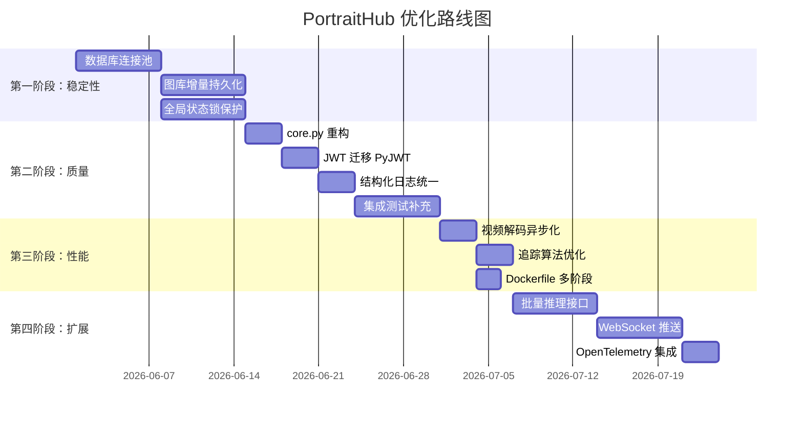

# PortraitHub 项目优化与扩展方案

本报告基于对 PortraitHub v0.5.24 全部源码、配置、测试、部署模板和更新日志的深入审查，从架构安全、性能瓶颈、代码质量、可运维性和功能扩展五个维度提出优化建议。

> [!UPDATE]
> 2026-06-15 / v0.5.26 已完成第一批落地：补齐 `pytest-asyncio` 与 `asyncio_mode = auto`，强化 Docker Compose 生产默认值，新增 `person_detection` 与 `body_embedding` 能力声明，并把 body/person 链路接入 YOLO 人体裁剪 + OSNet ReID 512 维向量路径；README、生产能力示例和更新日志已同步。数据库连接池、图库增量持久化、JWT 非对称算法、视频抽帧异步化等 P0/P1 建议仍建议继续按优先级推进。

> [!NOTE]
> 本报告仅提出方案建议，不改动任何源码。每项建议按 **优先级（P0 紧急 / P1 重要 / P2 改进 / P3 扩展）** 标注，供逐步推进。

---

## 一、架构与安全

### 1.1 `core.py` 通配导入污染命名空间 — P1

[core.py](file:///e:/portrait-hub/app/core.py) 使用了 13 个 `from xxx import *`，将所有模块的全部符号注入到单一命名空间。

**风险**：
- 模块间同名符号静默覆盖（如 `observe`、`logger` 在 `observability.py` 和 `metrics.py` 中均存在）
- IDE 和静态分析器无法追踪符号来源，增加维护负担
- 新增模块时容易引入意外冲突

**建议**：
- 将 `core.py` 改为显式导入（`from app.settings import APP_VERSION, MODELS_ROOT, ...`）
- 或将 `core.py` 拆为 `core_settings.py`、`core_runtime.py` 等，按职责分组导入
- 各路由模块直接导入具体子模块，而非依赖 `core.py` 中转

---

### 1.2 数据库连接无连接池 — P0

[portrait_postgres.py](file:///e:/portrait-hub/app/portrait_postgres.py#L40-L47) 的 `postgres_connection()` 每次调用都 `psycopg.connect()` 创建新连接，无连接池。

**风险**：
- 高并发下 PostgreSQL 连接数暴涨，可能触发 `too many connections`
- 每次建连的 TCP 三次握手 + TLS 协商增加 20-50ms 延迟
- 图库入库、审计写入、任务更新等高频操作会放大此问题

**建议**：
```python
# 使用 psycopg_pool（psycopg3 官方连接池）
from psycopg_pool import ConnectionPool

POOL = ConnectionPool(
    conninfo=POSTGRES_DSN,
    min_size=2,
    max_size=10,
    timeout=POSTGRES_CONNECT_TIMEOUT_SECONDS,
)

@contextmanager
def postgres_connection(row_factory=None):
    with POOL.connection() as conn:
        if row_factory:
            conn.row_factory = row_factory
        yield conn
```
- `psycopg_pool` 已包含在 `psycopg[binary]` 依赖中，无需额外安装
- 池化后可复用 TCP 连接，大幅降低延迟和服务端连接压力

---

### 1.3 JWT 认证仅支持 HS256 — P1

[portrait_auth.py](file:///e:/portrait-hub/app/portrait_auth.py#L157) 手工实现了 HS256 JWT 验证，不支持 RS256/ES256 等非对称算法。

**风险**：
- HS256 要求签发方和验证方共享同一密钥，不适合多服务架构
- 手工 JWT 实现未使用 `PyJWT`（已在 `requirements-prod-optional.txt` 中引入但未使用）
- 密钥轮转逻辑复杂且手写，存在边界情况未覆盖的风险

**建议**：
- 将 JWT 验证迁移到 `PyJWT` 库，复用其成熟的签名验证、时间校验和 keyring 支持
- 新增 RS256 支持，允许配置公钥验签，支持外部 IdP（如 Keycloak、Auth0）签发令牌
- 保留 HS256 向后兼容，通过 `JWT_ALGORITHM` 环境变量切换

---

### 1.4 Qdrant 客户端未复用 — P2

[portrait_vector_store.py](file:///e:/portrait-hub/app/portrait_vector_store.py#L193-L198) 的 `_client()` 每次调用都 `QdrantClient(url=...)` 创建新实例。

**建议**：
- 在 `QdrantVectorStore.__init__` 中创建单例客户端，避免重复建连
- 增加 gRPC 模式支持（`prefer_grpc=True`），大批量向量操作性能可提升 2-3 倍

---

### 1.5 全局可变状态的线程安全 — P1

项目中多个全局字典作为运行时状态：

| 全局变量 | 文件 | 用途 |
|---------|------|------|
| `GALLERY` | [portrait_gallery.py](file:///e:/portrait-hub/app/portrait_gallery.py#L125) | 人像图库 |
| `VIDEO_JOBS` | [portrait_jobs.py](file:///e:/portrait-hub/app/portrait_jobs.py#L146) | 视频任务 |
| `METRICS` | [metrics.py](file:///e:/portrait-hub/app/metrics.py#L4) | 指标计数 |
| `BUCKETS` | [rate_limit.py](file:///e:/portrait-hub/app/rate_limit.py#L21) | 限流桶 |

**风险**：
- Uvicorn `--workers > 1` 时各 worker 进程的全局状态完全独立，限流和指标不一致
- asyncio 协程中对 dict 的并发读写虽然在 CPython GIL 下大多安全，但在极端场景（如字典 resize）可能出现不可预期行为

**建议**：
- 短期：在文档和启动脚本中明确 `--workers 1`（当前 Dockerfile CMD 已是 1，但需在部署文档中强调）
- 中期：引入 `asyncio.Lock` 保护关键写路径（Gallery CRUD、Job 状态机转换）
- 长期：将状态外迁到 Redis/PostgreSQL，消除进程内状态依赖

---

## 二、性能优化

### 2.1 图库全量序列化持久化 — P0

[portrait_gallery.py](file:///e:/portrait-hub/app/portrait_gallery.py#L166-L172) 中 `save_gallery_state()` 在 JSON 后端下每次变更都全量序列化整个图库写入磁盘。

**影响**：
- 图库 1000 人 × 5 特征时，单次写入的 JSON 可达 50MB+
- 每次 `upsert_person`、`add_feature`、`delete_person` 都触发全量写
- 高频操作下磁盘 I/O 成为性能瓶颈

**建议**：
- 引入增量写入模式：改为 append-only JSONL + 定期 compact
- 或引入 write-ahead-log（WAL）模式：变更先追加到 WAL，异步合并到主文件
- 生产环境推荐直接切换到 PostgreSQL 后端（已实现 `persist_person` 的 PG 路径）

---

### 2.2 视频抽帧在事件循环中阻塞 — P1

[portrait_jobs.py](file:///e:/portrait-hub/app/portrait_jobs.py#L311) 中 `extract_video_frames_from_bytes` 虽然是 `await` 调用，但内部的 OpenCV 解码是同步 CPU 密集操作。

**建议**：
- 将视频解码包装到 `asyncio.to_thread()` 或 `loop.run_in_executor()` 中，避免阻塞事件循环
- 对大视频文件，考虑先写入临时文件再用 FFmpeg subprocess 解码，避免全量加载到内存

---

### 2.3 追踪片段合并的 O(n³) 复杂度 — P2

[portrait_tracking.py](file:///e:/portrait-hub/app/portrait_tracking.py#L542-L565) 的 `merge_track_fragments` 使用三层嵌套循环 + `tracks.remove()`，在轨迹数量较多时性能退化明显。

**建议**：
- 使用 Union-Find 数据结构，将合并判定和执行分离
- 先收集所有可合并对，再批量执行，避免反复排序和列表删除

---

### 2.4 全局最优关联的指数级求解 — P2

[portrait_tracking.py](file:///e:/portrait-hub/app/portrait_tracking.py#L640-L718) 的 `global_match` 使用动态规划 + bitmask，虽然有 `max_exact_size=10` 限制，但 10×10 的搜索空间已达 10! = 362 万种排列。

**建议**：
- 引入 Hungarian Algorithm（匈牙利算法），时间复杂度从 O(n!) 降到 O(n³)
- `scipy.optimize.linear_sum_assignment` 是现成实现，但需考虑是否引入 scipy 依赖
- 或使用轻量级纯 Python 匈牙利算法实现，无外部依赖

---

### 2.5 Prometheus 指标拼接效率 — P2

[metrics.py](file:///e:/portrait-hub/app/metrics.py#L131-L290) 的 `prometheus_metrics()` 每次请求都拼接 160+ 行字符串。

**建议**：
- 引入缓存机制，每 5-10 秒刷新一次指标快照
- 或使用 `prometheus_client` 官方库（已有成熟的 FastAPI 集成方案）

---

## 三、代码质量

### 3.1 类型注解不一致 — P2

项目中部分函数使用了现代类型注解（`list[str]`、`dict[str, Any]`），但仍有许多函数的参数和返回值缺少注解。

**建议**：
- 在 `pytest.ini` 或 `pyproject.toml` 中配置 `mypy --strict`
- 逐步为核心模块补充完整的类型注解
- 重点关注 `portrait_gallery.py`、`portrait_tracking.py`、`portrait_model_runtime.py` 等大文件

---

### 3.2 大文件拆分 — P2

多个核心文件超过 700 行，职责过于集中：

| 文件 | 行数 | 建议拆分 |
|------|------|---------|
| [portrait_gallery.py](file:///e:/portrait-hub/app/portrait_gallery.py) | 894 行 | 拆分为 `gallery_state.py`（CRUD）+ `gallery_search.py`（检索聚合） |
| [portrait_tracking.py](file:///e:/portrait-hub/app/portrait_tracking.py) | 839 行 | 拆分为 `tracking_state.py`（TrackState）+ `tracking_association.py`（关联算法） |
| [portrait_model_runtime.py](file:///e:/portrait-hub/app/portrait_model_runtime.py) | 774 行 | 拆分为 `runtime_face.py`（人脸检测/嵌入）+ `runtime_pose.py`（姿态）+ `runtime_gait.py`（步态） |
| [portrait_postgres.py](file:///e:/portrait-hub/app/portrait_postgres.py) | 663 行 | 拆分为 `postgres_core.py`（连接管理）+ `postgres_gallery.py` + `postgres_jobs.py` |

---

### 3.3 测试覆盖盲区 — P1

当前 79 个测试主要覆盖算法和接口契约，但以下区域缺少测试：

- **PostgreSQL 集成测试**：所有 PG 相关代码标注了 `pragma: no cover`，缺少真实数据库测试
- **Qdrant 集成测试**：`QdrantVectorStore` 无任何测试覆盖
- **视频流 Worker**：[portrait_stream_worker.py](file:///e:/portrait-hub/app/portrait_stream_worker.py) 和 [portrait_stream_worker_daemon.py](file:///e:/portrait-hub/app/portrait_stream_worker_daemon.py) 缺少独立测试
- **并发安全测试**：缺少多协程同时操作 Gallery/Jobs 的并发竞态测试

**建议**：
- 使用 `testcontainers-python` 引入 PostgreSQL + Qdrant 容器化集成测试
- 为视频流 Worker 编写 mock-based 单元测试
- 新增压力测试脚本（`tools/load_test.py`）

---

### 3.4 错误处理统一化 — P2

项目中异常处理模式不一致：
- 部分模块返回 `None` 表示失败
- 部分模块抛出 `HTTPException`
- 部分模块静默 `logger.warning` 后继续

**建议**：
- 定义统一的业务异常层次（如 `PortraitError` → `GalleryError` / `InferenceError` / `StorageError`）
- 在路由层统一捕获转换为 HTTP 响应
- 内部模块不直接抛 `HTTPException`，保持业务逻辑与 HTTP 层解耦

---

## 四、可运维性

### 4.1 结构化日志 — P1

当前日志通过 `log_json()` 输出结构化 JSON，但 `logger.warning()`、`logger.info()` 等调用仍使用非结构化格式。

**建议**：
- 统一所有日志输出为 JSON 格式（通过 `python-json-logger` 或自定义 Formatter）
- 为每条日志附加 `request_id`、`tenant_id` 上下文（可用 `contextvars` 实现）
- 方便 ELK/Loki 等日志系统采集和检索

---

### 4.2 健康检查增强 — P2

当前 [routes_health.py](file:///e:/portrait-hub/app/routes_health.py) 的 `/ready` 检查了 CUDA Provider，但缺少：

- PostgreSQL 连接池健康状态
- Qdrant 连接可达性
- Redis 连接可达性（如启用了 Redis 队列）
- 磁盘空间检查（`runtime-state` 和 `objects` 目录）

**建议**：
- `/ready` 端点增加依赖组件的级联健康检查
- 返回每个组件的状态明细，方便 K8s 探针和告警配置

---

### 4.3 Dockerfile 多阶段构建 — P2

当前 [Dockerfile](file:///e:/portrait-hub/Dockerfile) 单阶段构建，镜像包含 `add-apt-repository`、`software-properties-common` 等编译期依赖的残留层。

**建议**：
```dockerfile
# 阶段 1：构建
FROM nvidia/cuda:12.4.1-cudnn-runtime-ubuntu22.04 AS builder
# ... 安装 Python、pip install 等

# 阶段 2：运行
FROM nvidia/cuda:12.4.1-cudnn-runtime-ubuntu22.04
COPY --from=builder /usr/local /usr/local
COPY app /workspace/app
# ...
```
- 减小最终镜像体积（预计可减少 200-400MB）
- 减少攻击面（不含编译工具链）

---

### 4.4 配置文件热更新 — P3

当前修改 `.env` 或 `models.yml` 需要重启服务。

**建议**：
- 为 `models.yml` 实现文件 watch + SIGHUP 热重载
- 阈值、限流参数等支持通过 Admin API 动态调整（部分已实现）
- 增加配置变更审计日志

---

## 五、功能扩展建议

### 5.1 WebSocket 实时推送 — P2

当前视频任务和视频流处理只能通过轮询 API 获取进度。

**建议**：
- 新增 `/ws/jobs/{job_id}` WebSocket 端点，实时推送任务进度
- 新增 `/ws/streams/{stream_id}` WebSocket 端点，实时推送检测事件
- 前端控制台可直接订阅，降低轮询压力

---

### 5.2 批量推理接口 — P1

当前人像比对、图库检索等接口仅支持单次请求。

**建议**：
- 新增 `/v1/compare/batch` 批量比对接口
- 新增 `/v1/gallery/search/batch` 批量检索接口
- 支持异步批量模式：提交后返回 `batch_id`，通过 Jobs 接口查询结果

---

### 5.3 模型版本灰度 A/B 测试 — P3

当前 `model-capabilities.yml` 支持模型绑定，但缺少流量分割能力。

**建议**：
- 在 capability 配置中增加 `traffic_split` 字段（如 `{"v1": 80, "v2": 20}`）
- 推理时按权重随机选择模型版本
- 在响应中标注使用的模型版本，便于离线评测对比

---

### 5.4 OpenTelemetry 分布式追踪 — P2

当前已有 `traceparent` 头透传和 `request_id` 注入，但缺少完整的分布式追踪。

**建议**：
- 引入 `opentelemetry-sdk` + `opentelemetry-instrumentation-fastapi`
- 自动为推理、数据库查询、向量检索生成 Span
- 支持导出到 Jaeger/Zipkin/OTLP Collector

---

### 5.5 数据导出与备份增强 — P2

当前 `/v1/admin/export` 支持全量导出，但缺少：

- **增量导出**：按时间范围导出变更
- **自动备份**：定时将图库快照备份到 S3
- **数据迁移工具**：JSON → PostgreSQL、PostgreSQL → Qdrant 的一键迁移脚本

---

### 5.6 前端控制台升级 — P3

当前控制台是内嵌的单页 HTML，功能受限。

**建议**：
- 将控制台拆为独立的前端项目（Vue/React）
- 新增仪表盘页面：模型推理 QPS、GPU 利用率、图库规模趋势
- 新增图库可视化：人员列表 + 特征分布散点图
- 新增告警配置页面：推理延迟、错误率阈值

---

## 六、依赖与版本管理

### 6.1 依赖版本锁定 — P1

[requirements.txt](file:///e:/portrait-hub/requirements.txt) 中 `cryptography>=42.0.0,<46.0.0` 范围过宽。

**建议**：
- 使用 `pip-compile`（pip-tools）生成锁定文件 `requirements.lock`
- 将宽版本范围仅保留在 `requirements.in` 中
- CI 中同时测试锁定版本和最新兼容版本

---

### 6.2 Python 版本统一声明 — P2

Dockerfile 指定 Python 3.12，但项目根目录缺少 `python-requires` 声明。

**建议**：
- 新增 `pyproject.toml`，声明 `requires-python = ">=3.11"`
- 将 `pytest.ini` 的配置合入 `pyproject.toml`
- 统一项目元数据管理

---

## 优先级汇总

| 优先级 | 事项 | 影响范围 |
|--------|------|---------|
| **P0** | 数据库连接池 | 生产稳定性 |
| **P0** | 图库全量序列化 | 性能瓶颈 |
| **P1** | 全局状态线程安全 | 并发正确性 |
| **P1** | core.py 通配导入 | 代码质量 |
| **P1** | JWT 升级 | 安全架构 |
| **P1** | 结构化日志 | 可观测性 |
| **P1** | 测试覆盖盲区 | 质量保障 |
| **P1** | 批量推理接口 | 功能完善 |
| **P1** | 依赖版本锁定 | 构建可靠性 |
| **P1** | 视频解码阻塞 | 服务响应性 |
| **P2** | 大文件拆分 | 可维护性 |
| **P2** | 类型注解 | 代码质量 |
| **P2** | 错误处理统一化 | 可维护性 |
| **P2** | 健康检查增强 | 运维效率 |
| **P2** | Dockerfile 多阶段 | 镜像优化 |
| **P2** | Prometheus 指标 | 性能 |
| **P2** | 追踪算法优化 | 性能 |
| **P2** | Qdrant 客户端复用 | 性能 |
| **P2** | WebSocket 推送 | 用户体验 |
| **P2** | OpenTelemetry | 可观测性 |
| **P2** | 数据导出增强 | 功能完善 |
| **P2** | Python 版本声明 | 工程规范 |
| **P3** | 模型 A/B 灰度 | 功能扩展 |
| **P3** | 前端控制台升级 | 功能扩展 |
| **P3** | 配置热更新 | 运维体验 |

---

## 建议实施路线



> [!IMPORTANT]
> 建议从第一阶段（P0）开始推进。数据库连接池和图库增量持久化是当前最紧迫的性能瓶颈，直接影响生产环境稳定性。
